## 1. Product Overview

NovaPOS is an enterprise SaaS Point of Sale platform for Morocco-first food and retail businesses, designed to continue operating normally during internet outages through an offline-first architecture.

- The product serves restaurants, cafes, coffee shops, bakeries, snack shops, fast food, retail stores, grocery stores, and supermarkets.
- The business value is uninterrupted sales operations, centralized multi-branch management, and a future-ready SaaS platform that can expand globally.
- The first implementation slice focuses on the operational foundation required to start real branch usage: authentication, branch/device context, product catalog, POS checkout, payment capture, receipt printing readiness, local offline storage, and automatic event synchronization groundwork.

## 2. Core Features

### 2.1 User Roles

| Role | Registration Method | Core Permissions |
|------|---------------------|------------------|
| Super Admin | Internal platform provisioning | Manage platform-level tenant lifecycle, support, and global controls |
| Business Owner | Tenant invitation or bootstrap onboarding | Manage business settings, branches, users, roles, reporting, and configuration |
| Manager | Business owner invitation | Manage branch operations, products, inventory visibility, reports, printer settings, and overrides |
| Cashier | Manager or owner assignment | Create orders, take payments, print receipts, open and close cash sessions |
| Waiter | Manager assignment | Create and manage table-linked orders, route items to kitchen |
| Kitchen | Manager assignment | View and update kitchen tickets and preparation states |
| Inventory Manager | Manager or owner assignment | Manage stock adjustments, counts, receiving, waste, and purchasing |
| Accountant | Owner or manager assignment | Review invoices, expenses, reconciliation, and finance-focused reports |

### 2.2 Feature Modules

1. **Login and Session Recovery**: online login, local session restore, branch and device context bootstrap
2. **Branch Workspace Shell**: role-aware navigation, network state, sync state, active branch/device indicators
3. **POS Checkout**: product browsing, quick add, cart, order totals, discounts, taxes, payment completion
4. **Receipt and Printing Flow**: logical receipt output flow, printer selection state, print confirmation
5. **Offline Engine Foundation**: IndexedDB persistence, local projections, immutable event queue, retry metadata
6. **Synchronization Foundation**: background upload loop, duplicate protection, server acknowledgement handling
7. **Catalog and Branch Data Cache**: products, categories, prices, tax profiles, business and branch settings
8. **Admin Foundation**: business, branch, user, and role management screens sufficient to bootstrap branch usage
9. **Dashboard Foundation**: branch summary, sync backlog visibility, operational quick actions

### 2.3 Page Details

| Page Name | Module Name | Feature Description |
|-----------|-------------|---------------------|
| Login | Credentials Form | Sign in with email/username and password, handle invalid login, persist session safely |
| Login | Session Recovery | Restore local session if device has valid locally cached context and policy allows |
| Branch Selection | Branch Picker | Select assigned branch after login when multiple branches are available |
| Branch Selection | Device Binding | Select or register logical device context for branch operations |
| Dashboard | Branch Summary | Show active branch, user role, cash session status, network health, sync health |
| Dashboard | Quick Actions | Jump to POS, admin, reports, inventory, and printer settings based on role |
| POS | Product Search | Search by name, category, barcode-ready pattern, and quick tiles |
| POS | Cart and Order Summary | Add/remove items, adjust quantity, apply discount, show tax and totals |
| POS | Payment Panel | Accept cash and future-ready split payment structure, mark sale paid locally |
| POS | Order Finalization | Commit immutable sale events, update stock locally, clear active cart |
| POS | Receipt Action Panel | Generate receipt from local data and trigger branch print workflow |
| Admin | Business and Branch Setup | View and edit business profile, branch metadata, business hours, branch settings |
| Admin | User and Role Management | View users, assign roles, manage branch access and permissions snapshot |
| Settings | Printer Mapping | Assign logical printer targets such as receipt and kitchen |
| Settings | Sync Monitoring | Show queue depth, last successful sync, last conflict, last retry |

## 3. Core Process

The first production-ready slice of NovaPOS must allow a branch to authenticate, load its local workspace, conduct sales locally, persist all business actions as immutable events, and synchronize automatically when connectivity is available. The cashier experience must remain fast and uninterrupted whether the branch is online or offline.

The primary operator journey is:

1. A user signs in and selects a branch and device context.
2. The application loads cached catalog, settings, permissions, and local projections.
3. The cashier creates an order and takes payment entirely against local state.
4. The system writes immutable events into the local event queue and updates local projections in the same transaction.
5. Receipt printing runs locally without waiting for the backend.
6. If the internet is available, queued events synchronize in the background.
7. If the internet is unavailable, the user continues working and synchronization resumes later with no manual action.

```mermaid
flowchart LR
    A["User logs in"] --> B["Branch and device context selected"]
    B --> C["Local workspace loads cached data and projections"]
    C --> D["Cashier creates order locally"]
    D --> E["Payment is captured locally"]
    E --> F["Immutable events are stored in IndexedDB queue"]
    F --> G["Receipt is printed locally"]
    G --> H{"Network available?"}
    H -->|Yes| I["Background sync uploads queued events"]
    H -->|No| J["Branch continues offline with local state"]
    J --> K["Connectivity returns"]
    K --> I
    I --> L["Server acknowledges events and updates cursors"]
```

## 4. User Interface Design

### 4.1 Design Style

- Primary direction: dark, premium operations console with high-contrast transactional surfaces
- Color system: graphite and charcoal foundation, warm sand neutrals, vivid mint and amber operational accents, restrained error red
- Button style: dense, tactile, rounded-rectangle controls with strong press and hover states for touch terminals
- Typography: distinctive display face for page identity and a highly legible operational sans-serif for transactional content
- Layout style: desktop-first control room layout with anchored navigation, dense work panels, and quick-access cashier controls
- Icon style suggestions: sharp line icons with bold status dots, operational badges, and printer/sync-specific indicators

### 4.2 Page Design Overview

| Page Name | Module Name | UI Elements |
|-----------|-------------|-------------|
| Login | Credentials Form | Centered authentication panel, strong trust cues, branch-grade operational aesthetic |
| Branch Selection | Branch Picker | Compact branch cards, role and location metadata, clear device context selector |
| Dashboard | Branch Summary | KPI tiles, sync status strip, branch health indicators, role-aware shortcuts |
| POS | Product Search | Large searchable catalog grid, category rails, barcode-ready input placement |
| POS | Cart and Payment | Sticky cart, visible total hierarchy, one-tap payment actions, tactile amount controls |
| POS | Receipt Actions | Clear receipt actions, print feedback, last order summary, reprint readiness |
| Admin | User and Role Management | Data grid with role badges, branch filters, permission summaries |
| Settings | Printer and Sync Panels | Operational cards, queue metrics, printer target map, branch infrastructure visibility |

### 4.3 Responsiveness

- Desktop-first by default because branch terminals, cashier screens, and back-office workstations are the primary target
- Tablet-adaptive layouts for touch devices used in restaurants and cafes
- Touch optimization for key POS controls, payment buttons, and quick product selection
- Mobile support is secondary for management and reporting views, not for the primary cashier station

### 4.4 Offline-First Interaction Guidance

- Network loss must surface as a calm status change, never as a blocking modal during sales
- Sync status should be visible but not intrusive
- The POS must always read from local projections first
- Critical operator confidence signals must include active branch, active device, local queue depth, and last sync success time
- Printing interactions must never depend on a successful round-trip to the backend

## 5. Scope Boundaries for the First Implementation Slice

Included now:

- Authentication foundation
- Branch and device context
- Role-aware shell
- Product catalog caching
- POS checkout flow
- Payment completion flow
- Receipt-print readiness
- Offline local storage foundation
- Immutable local event queue
- Sync API contract foundation
- Dashboard and admin bootstrap screens

Deferred to later slices:

- Full kitchen production workflow
- Full inventory operations
- Purchasing and receiving
- Advanced reporting
- Full SaaS subscription lifecycle
- Multi-branch consolidation features beyond branch selection and scope handling

