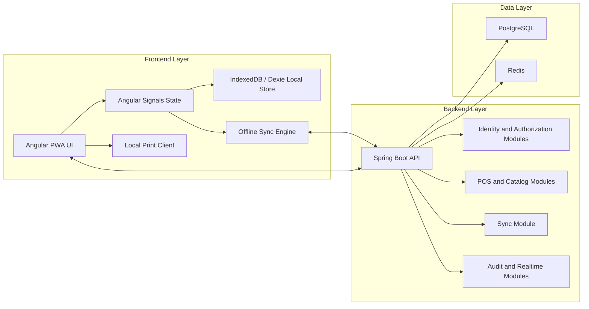
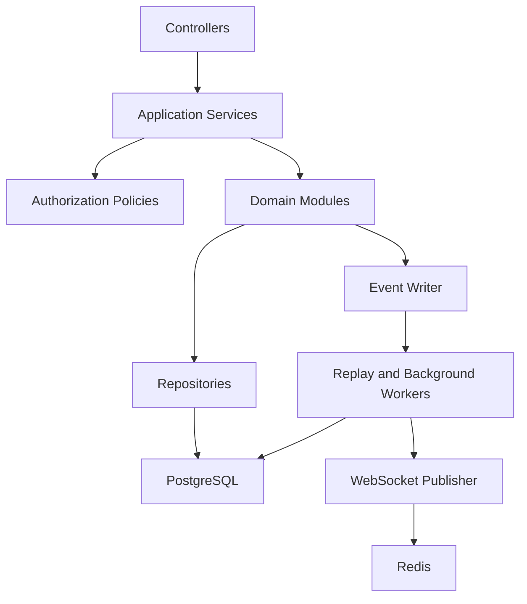
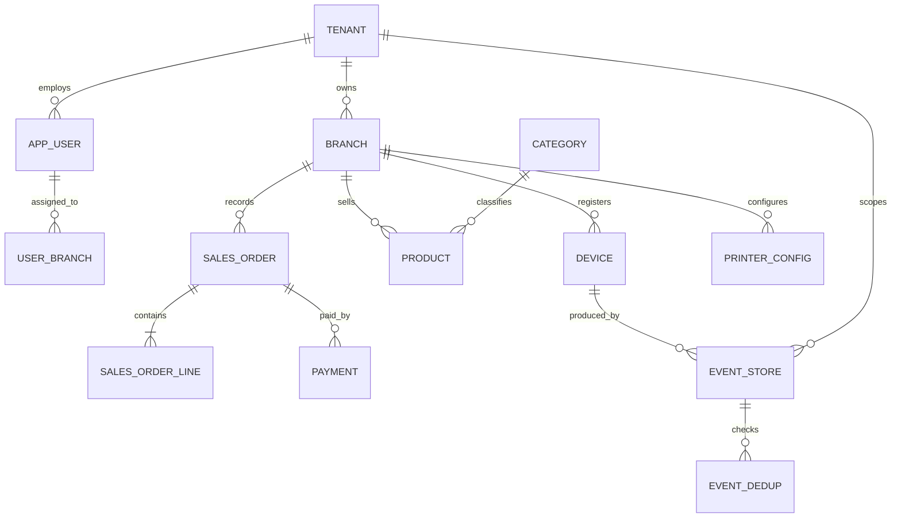
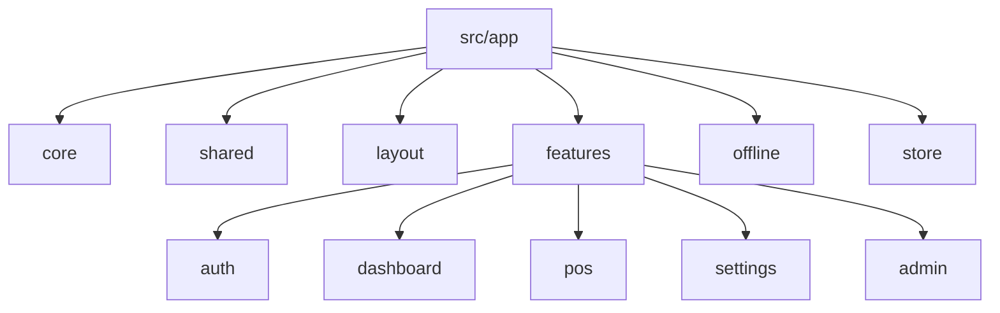

## 1. Architecture Design

The initial NovaPOS implementation will be built as a full-stack offline-first web application with an Angular PWA frontend, a Spring Boot modular monolith backend, PostgreSQL as the system of record, Redis for transient coordination, and IndexedDB/Dexie for local-first device persistence.



## 2. Technology Description

- Frontend: Angular latest stable + TypeScript + Angular Signals + RxJS + Angular Router
- Frontend offline storage: IndexedDB + Dexie
- Frontend delivery: PWA with installable shell and cached assets
- UI foundation: Angular Material plus project-specific design system layer
- Backend: Java 21 + Spring Boot 3 + Spring Security + Spring Data JPA + Hibernate + Bean Validation
- Database: PostgreSQL
- Cache and transient coordination: Redis
- Realtime: WebSocket
- Database migrations: Flyway
- Build tools: Maven for backend, Angular CLI or workspace-native tooling for frontend
- Deployment target: Docker + Dokploy + Traefik on a single VPS

## 3. Route Definitions

| Route | Purpose |
|-------|---------|
| `/login` | Authenticate the user and begin local session bootstrap |
| `/select-branch` | Select branch and device context after authentication |
| `/dashboard` | Show branch summary, operational shortcuts, sync state, and user context |
| `/pos` | Main cashier workspace for product selection, cart management, payment, and receipt actions |
| `/settings` | Branch printer, sync, and operational settings |
| `/admin/business` | Manage business profile and tenant-scoped administrative settings |
| `/admin/branches` | Manage and inspect branch records |
| `/admin/users` | Manage users, roles, and branch assignments |

## 4. API Definitions

### 4.1 Authentication APIs

| Method | Endpoint | Purpose |
|--------|----------|---------|
| `POST` | `/api/auth/login` | Authenticate user and return access and refresh tokens plus branch summary data |
| `POST` | `/api/auth/refresh` | Rotate refresh token and issue a new access token |
| `POST` | `/api/auth/logout` | Revoke active session context |
| `GET` | `/api/auth/me` | Load authenticated user context, permissions, tenant, and branch assignments |

### 4.2 Bootstrap and Catalog APIs

| Method | Endpoint | Purpose |
|--------|----------|---------|
| `GET` | `/api/bootstrap/session` | Return startup payload for selected branch and device context |
| `GET` | `/api/catalog/products` | Return branch-scoped product catalog for local caching |
| `GET` | `/api/catalog/categories` | Return branch-scoped categories |
| `GET` | `/api/settings/printers` | Return printer routing and logical printer configuration |

### 4.3 POS APIs

| Method | Endpoint | Purpose |
|--------|----------|---------|
| `GET` | `/api/pos/orders/{orderId}` | Return authoritative order projection when online |
| `POST` | `/api/pos/orders/search` | Search online orders when needed for recovery or review |
| `GET` | `/api/dashboard/summary` | Return branch-level summary cards and operational status |

### 4.4 Synchronization APIs

| Method | Endpoint | Purpose |
|--------|----------|---------|
| `POST` | `/api/sync/events` | Accept ordered batches of immutable device events |
| `GET` | `/api/sync/status` | Return branch and device sync health, last cursor, and backlog metadata |
| `GET` | `/api/sync/bootstrap` | Return server cursor and replay metadata during session bootstrap |

### 4.5 API Contract Shapes

```typescript
type AuthSessionResponse = {
  accessToken: string;
  refreshToken: string;
  user: {
    id: string;
    displayName: string;
    tenantId: string;
    roles: string[];
    permissions: string[];
    branchAssignments: Array<{
      branchId: string;
      branchName: string;
      defaultDeviceType: string;
    }>;
  };
};

type SyncEventEnvelope = {
  eventUuid: string;
  tenantId: string;
  branchId: string;
  deviceId: string;
  deviceSequence: number;
  timestamp: string;
  eventType: string;
  aggregateType: string;
  aggregateId: string;
  aggregateVersion: number;
  schemaVersion: number;
  status: "PENDING" | "IN_FLIGHT" | "ACKNOWLEDGED" | "CONFLICT";
  correlationId?: string;
  causationId?: string;
  payload: Record<string, unknown>;
};

type SyncBatchRequest = {
  branchId: string;
  deviceId: string;
  lastKnownServerCursor?: string;
  events: SyncEventEnvelope[];
};

type SyncBatchResponse = {
  acceptedEventUuids: string[];
  duplicateEventUuids: string[];
  conflictedEventUuids: string[];
  serverCursor: string;
};
```

## 5. Server Architecture Diagram



### Server Module Responsibilities

| Module | Responsibility |
|---|---|
| Identity | Login, token issuance, refresh rotation, logout, local session compatibility rules |
| Authorization | Permission evaluation and route/resource access checks |
| Tenant | Business, branch, device, and tenant-scoped startup metadata |
| Catalog | Products, categories, tax profiles, pricing, and product bootstrap cache |
| POS | Order aggregate projection, payment acceptance, cashier session support |
| Sync | Event ingestion, dedupe, acknowledgement, replay coordination, cursor tracking |
| Printing | Printer configuration, print audit metadata, logical routing data |
| Audit | Security and business audit trails |
| Realtime | Dashboard and future kitchen live updates |

## 6. Data Model

### 6.1 Data Model Definition



### 6.2 Local Device Data Definition

| Local Store | Purpose |
|---|---|
| `session_context` | Current authenticated user, selected branch, selected device, token metadata |
| `catalog_cache` | Products, categories, tax profiles, and pricing for branch operations |
| `order_projection` | Current orders and local checkout state |
| `event_queue` | Immutable pending and acknowledged events with sync status |
| `sync_cursor` | Last successful server cursor and replay checkpoint |
| `printer_config` | Cached logical printer mappings |
| `dashboard_cache` | Branch summary data for quick shell rendering |

### 6.3 Data Definition Language

```sql
create table tenant (
  id uuid primary key,
  code varchar(64) not null unique,
  name varchar(255) not null,
  created_at timestamptz not null
);

create table branch (
  id uuid primary key,
  tenant_id uuid not null references tenant(id),
  name varchar(255) not null,
  code varchar(64) not null,
  timezone varchar(64) not null,
  created_at timestamptz not null,
  unique (tenant_id, code)
);

create table device (
  id uuid primary key,
  tenant_id uuid not null references tenant(id),
  branch_id uuid not null references branch(id),
  device_code varchar(64) not null,
  device_type varchar(32) not null,
  last_sync_at timestamptz,
  unique (tenant_id, branch_id, device_code)
);

create table event_store (
  id bigserial primary key,
  event_uuid uuid not null,
  tenant_id uuid not null references tenant(id),
  branch_id uuid not null references branch(id),
  device_id uuid not null references device(id),
  aggregate_type varchar(64) not null,
  aggregate_id uuid not null,
  event_type varchar(128) not null,
  device_sequence bigint not null,
  aggregate_version bigint not null,
  schema_version integer not null,
  status varchar(32) not null,
  payload_json jsonb not null,
  occurred_at timestamptz not null,
  received_at timestamptz not null,
  unique (tenant_id, event_uuid),
  unique (tenant_id, device_id, device_sequence)
);

create index idx_event_store_tenant_device_sequence
  on event_store (tenant_id, device_id, device_sequence);

create index idx_event_store_aggregate
  on event_store (tenant_id, aggregate_type, aggregate_id, aggregate_version);
```

## 7. Frontend Application Structure



### Frontend Responsibility Map

| Area | Responsibility |
|---|---|
| `core` | bootstrap, interceptors, guards, auth client, API client, websocket client |
| `layout` | shell layout, top bar, side navigation, network and sync status UI |
| `features/auth` | login, branch selection, device selection, session recovery |
| `features/dashboard` | branch operational overview and sync summary |
| `features/pos` | cashier catalog, cart, payment, receipt actions |
| `features/settings` | printer mappings and sync visibility |
| `features/admin` | business, branch, user, and role bootstrap management |
| `offline` | Dexie schema, local repositories, event queue, sync engine, retry policy |
| `store` | application signals and shared computed state |

## 8. Implementation Priorities

1. Create the workspace structure for backend and frontend.
2. Implement authentication and branch/device bootstrap.
3. Implement the Angular shell and role-aware routing.
4. Implement Dexie local stores and session bootstrap cache.
5. Implement POS checkout local-first flow.
6. Implement the backend sync ingestion contract and dedupe guards.
7. Implement sync loop and acknowledgement handling.
8. Implement admin and settings bootstrap screens.

## 9. Engineering Rules

- All write-side business actions must produce immutable events.
- The frontend must write locally first for supported branch workflows.
- The backend must accept repeated event uploads idempotently.
- Tenant, branch, and device context are mandatory in all write paths.
- Printing must not depend on a successful backend round-trip.
- The first build must prioritize reliability, operator speed, and architectural correctness over breadth of features.

