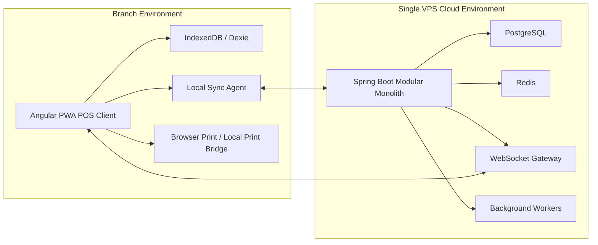
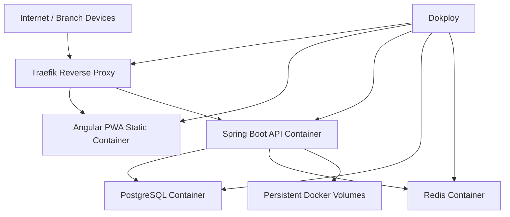
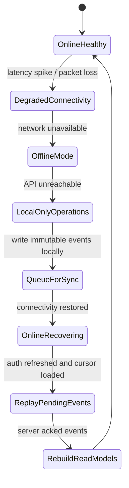
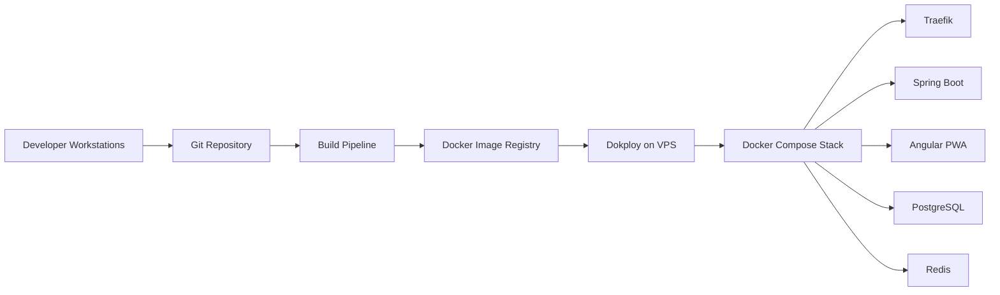
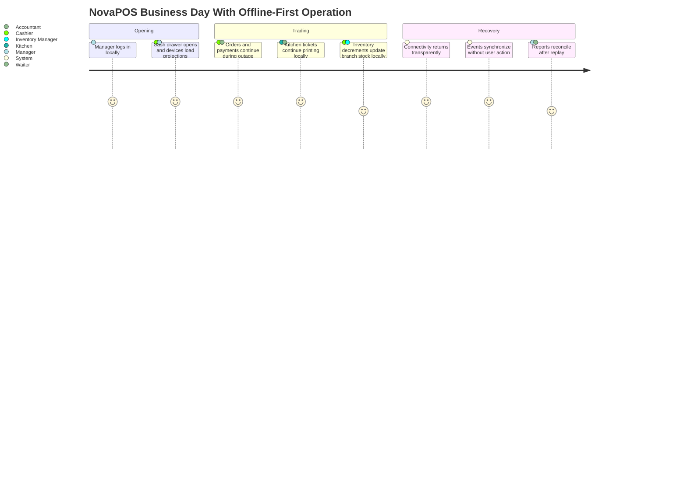

# 01. System Overview

## Goals

- Deliver an enterprise SaaS POS platform for Morocco-first businesses with future global expansion.
- Guarantee uninterrupted branch operations during internet outages through an offline-first architecture.
- Support restaurants, cafes, bakeries, fast food, retail, grocery, and supermarket workflows in one product family.
- Preserve strong tenant isolation while enabling multi-branch operations under one business account.
- Use immutable business events for synchronization so recovery, replay, auditability, and analytics remain reliable.
- Keep implementation complexity manageable with a modular monolith that can later be split into services if needed.

## Business Requirements

- Cashiers, waiters, kitchen staff, managers, and back-office users must continue working when internet connectivity is unavailable.
- Each business is a tenant, and each tenant may operate multiple branches and multiple devices per branch.
- Branch devices must perform local sales, kitchen routing, inventory changes, expenses, customer updates, and receipt printing without cloud dependency.
- When connectivity returns, synchronization must resume automatically with no user interaction, no page reload, and no workflow interruption.
- The platform must support ESC/POS receipt printers, kitchen printers, and invoice printers.
- SaaS hosting must run on a single VPS using Docker, Dokploy, Traefik, PostgreSQL, and Redis.

## Functional Requirements

- Authentication and JWT-based session management.
- Business, branch, user, role, and permission management.
- POS order lifecycle for dine-in, takeaway, and retail checkout.
- Table management and kitchen order routing for hospitality.
- Product catalog, categories, pricing, taxes, discounts, and modifiers.
- Inventory control, stock adjustments, stock consumption, counts, waste, suppliers, purchase orders, and goods receiving.
- Payments, invoices, refunds, expenses, and audit trails.
- Operational dashboards, reports, notifications, and synchronization monitoring.
- Offline event capture, local projections, background synchronization, and conflict handling.

## Non-Functional Requirements

- Offline-first operation for at least multi-hour internet outages.
- Zero cashier-visible disruption during network loss.
- Strong tenant isolation enforced in application, data, cache, and audit layers.
- Idempotent event processing and duplicate prevention across devices.
- Horizontal read scalability is optional; operational simplicity is mandatory.
- Sub-second local UI response for core POS interactions.
- Full auditability of security-sensitive and finance-sensitive actions.
- Support future localization, tax rules, and country-specific payment extensions.

## High-Level Architecture

## Cloud Architecture

## Offline Architecture

## Deployment Architecture

## Technology Decisions

| Decision | Selected Technology | Why |
|---|---|---|
| Backend runtime | Java 21 + Spring Boot 3 | Mature enterprise stack, strong modularity, reliability, validation, and security ecosystem. |
| Backend architecture | Modular Monolith | Lower operational overhead than microservices while preserving clear module boundaries and future extractability. |
| Persistence | PostgreSQL | Strong relational consistency, JSON support for events, and proven transactional behavior. |
| Cache / transient coordination | Redis | Efficient token/session helpers, WebSocket fanout support, and lightweight synchronization coordination. |
| Frontend | Angular + TypeScript | Strong structure for large enterprise applications, dependency injection, routing, and testing discipline. |
| Reactive UI model | Angular Signals + RxJS | Signals simplify local state; RxJS remains useful for streams, websockets, and sync flows. |
| Local storage | IndexedDB + Dexie | Browser-native offline persistence with ergonomic indexing and transactions. |
| Transport | REST + WebSocket | REST for commands and sync endpoints; WebSocket for live updates, kitchen events, and operator awareness. |
| Auth | JWT + refresh tokens | Supports stateless API access while enabling controlled session renewal. |
| Schema evolution | Flyway | Deterministic, auditable database migration workflow. |
| Hosting | Docker + Dokploy + Traefik | Simple VPS deployment with HTTPS, routing, and container lifecycle management. |

## Design Principles

- Offline-first before cloud-first.
- Events are immutable; projections are replaceable.
- Local device autonomy with eventual server convergence.
- Tenant, branch, and device scope are explicit in every write path.
- Modules own their data and business rules.
- Reads are optimized through projections, not by mutating historical facts.
- Security and auditability are built into each business operation.
- Operational simplicity is preferred over distributed-system complexity.

## Business Capability Journey

## Core Domain Boundaries

| Domain | Responsibility |
|---|---|
| Identity & Access | Authentication, authorization, roles, permissions, and session lifecycle. |
| Tenant Management | Businesses, subscriptions, branches, device registration, and global tenant settings. |
| POS Sales | Orders, line items, discounts, taxes, payments, receipts, refunds, and cashier sessions. |
| Hospitality | Tables, dining areas, service flow, kitchen routing, and ticket lifecycle. |
| Catalog | Products, categories, modifiers, pricing, tax profiles, and barcode references. |
| Inventory & Purchasing | Stock movements, counts, waste, suppliers, purchase orders, and receiving. |
| CRM & Finance | Customers, invoices, expenses, and financial audit trails. |
| Reporting & Audit | Operational reports, ledger-style event history, and compliance visibility. |
| Synchronization | Local event queueing, replay, deduplication, conflict handling, and cursor management. |
| Printing & Realtime | ESC/POS output, kitchen printing, invoice printing, and WebSocket updates. |

