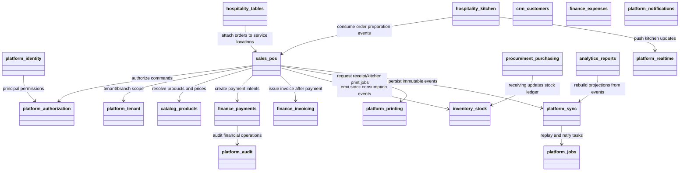
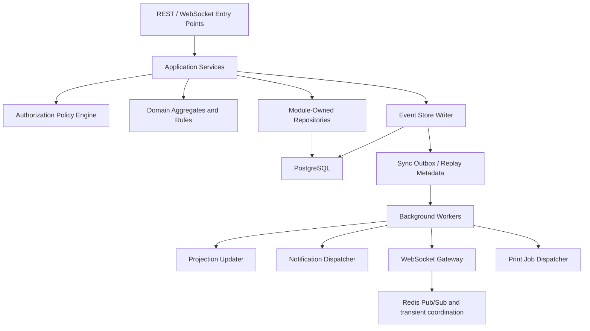
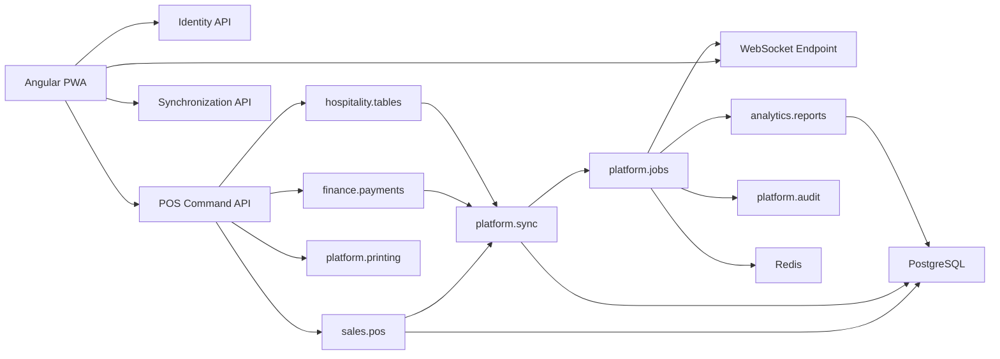
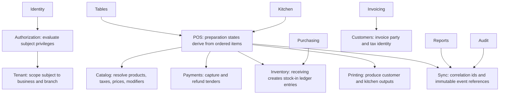
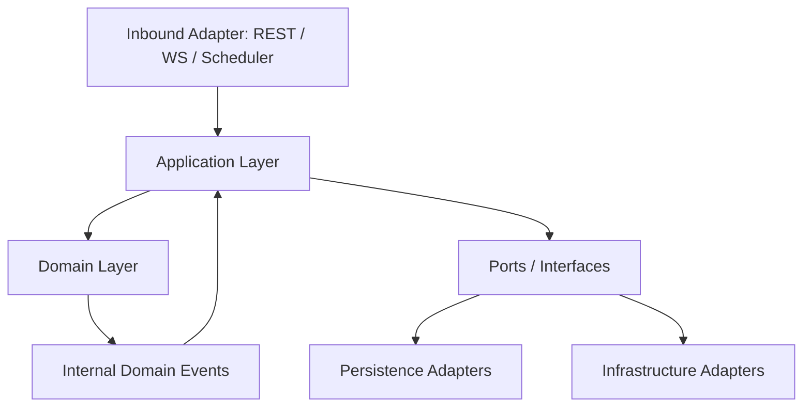
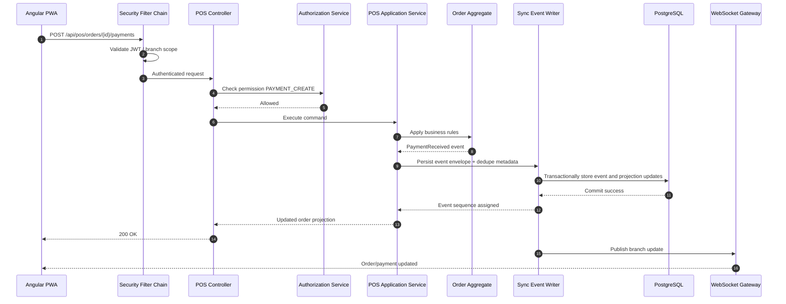
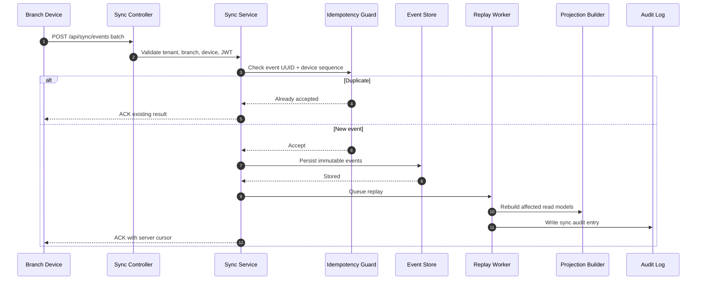

# 02. Backend Architecture

## Backend Style

The backend is a modular monolith implemented with Java 21 and Spring Boot 3. Each module owns its domain model, application services, persistence adapters, and internal events. Modules communicate through explicit interfaces and domain events inside one deployable application.

## Module Responsibilities

| Module | Responsibilities | Why It Exists |
|---|---|---|
| `platform.identity` | Authentication, JWT issuance, refresh token rotation, password policy, session revocation | Centralizes security-critical logic. |
| `platform.authorization` | Roles, permissions, policy evaluation, route/resource access checks | Separates identity proof from permission decisions. |
| `platform.tenant` | Businesses, branches, business settings, device registration | Enforces SaaS isolation and operational scoping. |
| `sales.pos` | Orders, order lines, discounts, taxes, cashier sessions, sales lifecycle | Core transactional POS workflow. |
| `hospitality.tables` | Dining areas, tables, seat movement, merge/split support | Required for restaurant and cafe operations. |
| `hospitality.kitchen` | Ticket generation, kitchen queues, preparation states, display synchronization | Decouples prep flow from cashier flow. |
| `catalog.products` | Products, categories, variants, modifiers, barcode lookup, pricing rules | Single source of saleable item definitions. |
| `inventory.stock` | Stock ledgers, counts, waste, adjustments, transfers, thresholds | Keeps inventory behavior consistent and auditable. |
| `procurement.purchasing` | Suppliers, purchase orders, receiving, cost updates | Supports replenishment and supply chain control. |
| `crm.customers` | Customer profiles, loyalty-ready profile base, sales association | Needed for invoices, reporting, and customer service. |
| `finance.payments` | Payment capture, split tenders, refunds, settlement states | Keeps money flow explicit and controlled. |
| `finance.invoicing` | Invoice issuance, numbering, compliance-ready invoice records | Separates tax document generation from order flow. |
| `finance.expenses` | Expenses, categories, approvals, branch cost tracking | Covers store-level expense management. |
| `analytics.reports` | Aggregates, branch KPIs, reconciliations, snapshot reports | Avoids polluting transactional modules with report concerns. |
| `platform.notifications` | In-app notifications, operational alerts, optional email/SMS adapters | Central point for operator-facing messaging. |
| `platform.audit` | Security audit logs, business audit logs, trace links to events | Required for accountability and investigations. |
| `platform.sync` | Event ingestion, replay, dedupe, cursoring, replay status, recovery | Backbone of offline-first consistency. |
| `platform.printing` | Receipt templates, kitchen print jobs, printer routing metadata | Encapsulates print concerns and branch device mapping. |
| `platform.realtime` | WebSocket session channels, topic fanout, branch presence | Supports live kitchen and manager dashboards. |
| `platform.jobs` | Background workers, retry handlers, cleanup, projection rebuilds | Keeps heavy and asynchronous work off request threads. |

## Package Diagram

## Component Diagram

## Communication Diagram

## Dependency Diagram With Rationale

## Internal Layering Per Module

## Request Lifecycle

## Synchronization Lifecycle

## Data Ownership Rules

- `platform.identity` owns credentials, refresh tokens, login attempts, and session revocations.
- `platform.tenant` owns businesses, branches, branch settings, and registered devices.
- `sales.pos` owns orders, order lines, discounts, cashier shifts, and sales state transitions.
- `finance.payments` owns payment records and refund state.
- `inventory.stock` owns the stock ledger and derived on-hand values.
- `platform.sync` owns event envelopes, inbound/outbound cursors, replay checkpoints, and dedupe records.
- `platform.audit` owns append-only audit logs and correlation metadata.

## Cross-Cutting Concerns

| Concern | Approach |
|---|---|
| Transactions | One database transaction per command where event persistence and projection updates must succeed together. |
| Validation | Bean Validation at API boundaries plus domain rule validation inside aggregates. |
| Multi-tenancy | Tenant ID mandatory on all persistent business records and all query filters. |
| Observability | Structured logs, correlation ID, device ID, branch ID, and tenant ID on every request. |
| Security | Spring Security with JWT, refresh tokens, policy-based permission checks, and audit hooks. |
| Background Work | Spring scheduled tasks / async executors for sync replay, retries, cleanup, and report refresh. |

## Future Microservice Migration Readiness

- Module contracts are explicit and should be exposed through interfaces and internal event types.
- Database ownership is logically partitioned by module, even when physically shared.
- Sync, printing, reporting, and notifications are good future extraction candidates because they already operate asynchronously.
- Identity and tenant modules may later become separate services once scale or compliance justifies it.

