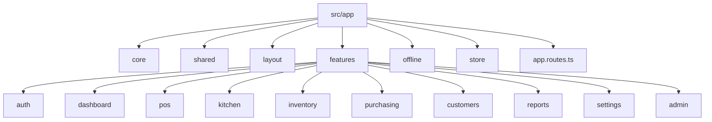
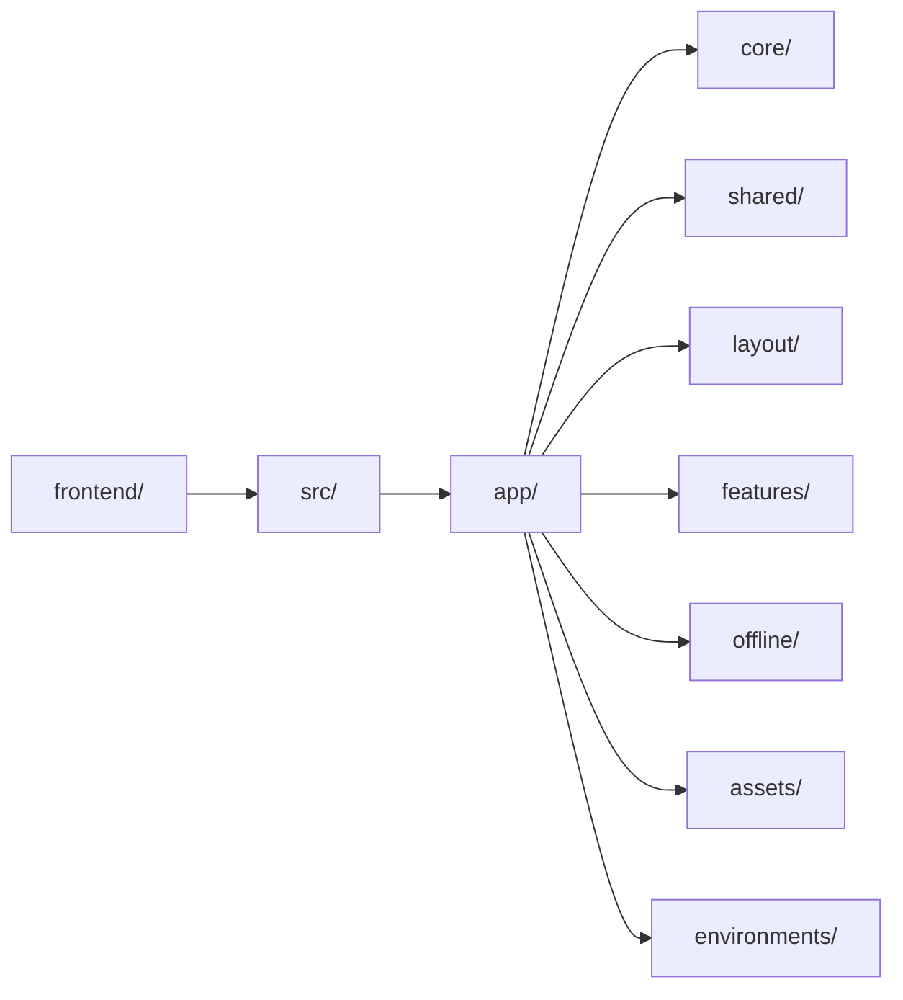
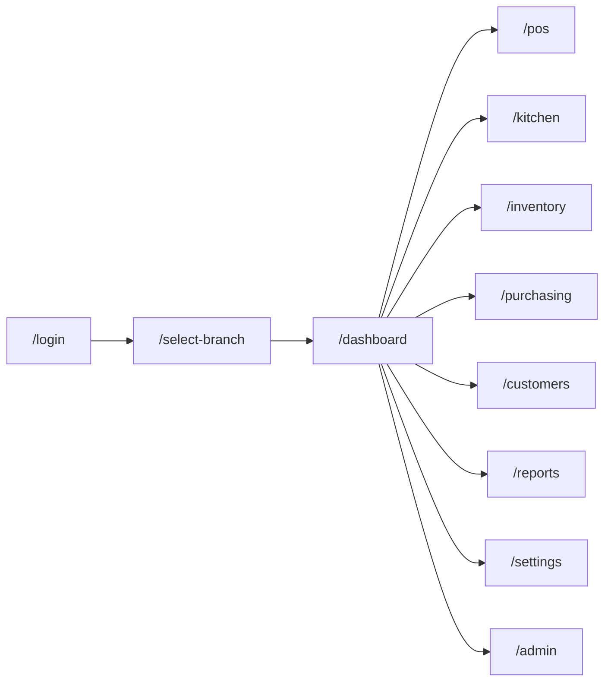
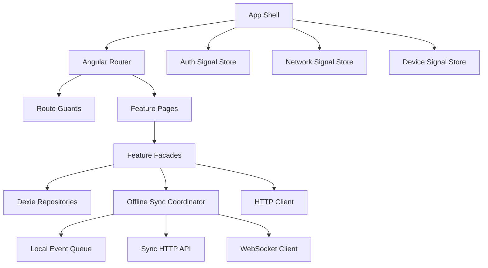
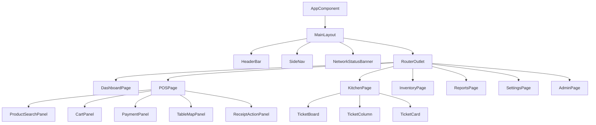
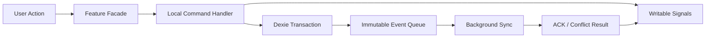
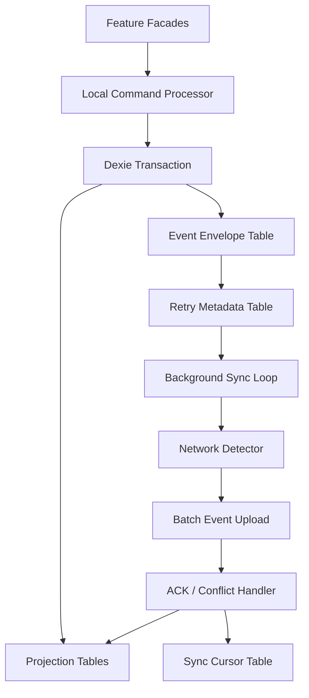
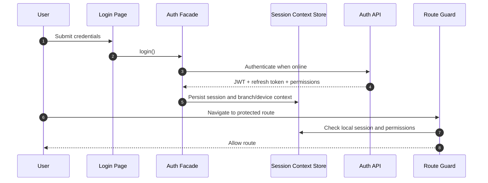
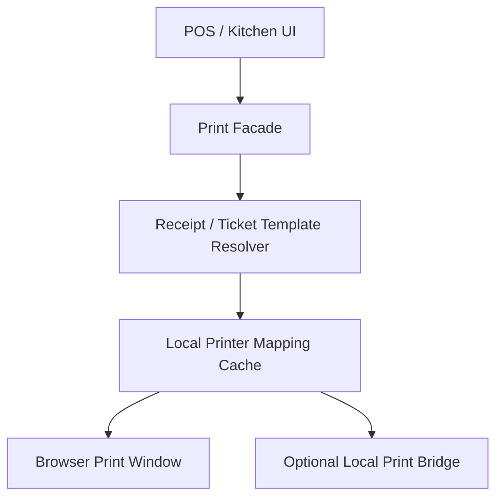
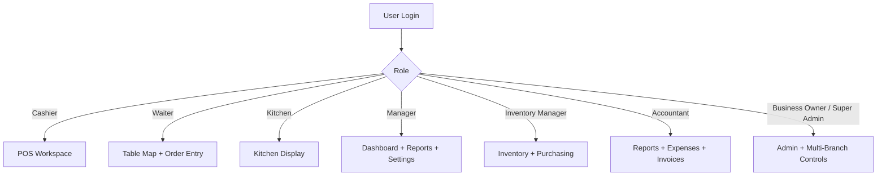

# 03. Frontend Architecture

## Frontend Principles

- The frontend is an Angular PWA designed to remain operational offline.
- Business workflows read from and write to local IndexedDB first.
- UI state is composed from Angular Signals for local deterministic state and RxJS streams for asynchronous flows.
- Network loss must never block cashier-visible workflows.
- All synchronization responsibilities are isolated inside the offline engine rather than scattered through feature modules.

## Angular Project Structure

## Folder Hierarchy

## Suggested Frontend Folders

| Area | Responsibility |
|---|---|
| `core` | App bootstrap, configuration, auth client, interceptors, guards, shell services, websocket client. |
| `shared` | Reusable UI components, directives, pipes, utility models, formatter helpers, form helpers. |
| `layout` | Main shell, header, sidebar, branch selector, device status banner, role-aware navigation. |
| `features/auth` | Login, refresh, branch selection, device registration, session recovery. |
| `features/pos` | Order builder, cart, payment panel, table assignment, receipt actions, cashier session UI. |
| `features/kitchen` | Kitchen display board, ticket queues, item status transitions, expediter view. |
| `features/inventory` | Stock dashboard, counts, waste, adjustments, products, categories, stock alerts. |
| `features/purchasing` | Suppliers, purchase orders, receiving, costing summaries. |
| `features/customers` | Customer search, profile, history, invoice identity data. |
| `features/reports` | KPI tiles, sales summaries, inventory movement reports, cash reconciliation. |
| `features/settings` | Branch settings, printers, taxes, numbering, receipt templates, sync settings view. |
| `features/admin` | Business, branches, users, roles, permissions, subscription-ready tenant controls. |
| `offline` | Dexie schema, local repositories, event queue, conflict markers, background sync coordinator. |
| `store` | Shared state signals, selectors, computed state, and event-driven UI coordination. |

## App Routing

## Feature Module Responsibilities

| Feature | Primary UI Capabilities | Offline Behavior |
|---|---|---|
| Auth | Login, refresh, branch/device activation | Uses last known branch/device context when cloud is unavailable and an active local session remains valid. |
| POS | Cart, order lifecycle, payment, receipts, table assignment | Fully local writes; events queued for sync. |
| Kitchen | Ticket views and status changes | Local updates per device; websocket when available, local polling against IndexedDB otherwise. |
| Inventory | Counts, adjustments, waste, quick stock lookups | Local stock projections update instantly. |
| Purchasing | Create PO, receive goods, supplier lookups | Receipts and stock-in events are stored locally. |
| Customers | Create/update/search local customer records | Local records sync when online. |
| Reports | Branch operational dashboards | Reads local projections first, cloud-augmented data second. |
| Settings | Printers, branch settings, tax/profile views | Local cached settings drive operations offline. |
| Admin | Users, roles, branch management | Read-mostly offline with guarded write capabilities based on last sync state. |

## Core Runtime Architecture

## Component Hierarchy

## State Management Model

### Signal Store Boundaries

- `auth.store`: current user, permissions, tenant, branch, device context, token expiry hints.
- `network.store`: online/offline state, sync lag, retry status, websocket health.
- `pos.store`: active cart, order projections, tender progress, table context.
- `kitchen.store`: open tickets, prep states, workstation filters.
- `inventory.store`: stock summaries, count sessions, low-stock indicators.
- `admin.store`: users, roles, branches, printer mappings, system settings.

## Offline Engine

## IndexedDB / Dexie Schema Responsibilities

| Local Store | Purpose |
|---|---|
| `session_context` | Active tenant, branch, device, current shift, auth metadata. |
| `event_queue` | Immutable unsynced and acknowledged events with sequence numbers and status. |
| `order_projection` | Fast POS order reads and current cart/session states. |
| `inventory_projection` | On-hand quantities, counts, waste summaries, receiving views. |
| `catalog_cache` | Products, categories, prices, taxes, modifiers, barcodes. |
| `customer_cache` | Frequently used customer data and local creations/updates. |
| `printer_config` | Branch printer routing, kitchen station mapping, receipt templates. |
| `sync_cursor` | Server checkpoints, replay tokens, last successful sync markers. |
| `conflict_log` | Non-blocking conflict records for manager review and repair tools. |

## Authentication, Guards, and Interceptors

- Auth interceptor attaches JWT on online requests.
- Refresh interceptor silently rotates tokens before expiry when internet is available.
- Offline interceptor short-circuits command APIs to local command handlers when network is unavailable.
- Role guards evaluate local permission snapshots so navigation remains usable offline.

## Printing Architecture in Frontend

- The frontend decides which logical printer target applies: receipt, kitchen station, invoice.
- Print jobs are rendered from local data and executed without cloud dependency.
- The backend stores printer configuration and print audit records, but live branch printing does not wait for server confirmation.

## Navigation Flow by Role

## PWA Responsibilities

- Cache static assets and shell routes for rapid reload.
- Keep the app installable on tablets, touch terminals, and desktops.
- Support background sync triggers when browser capabilities permit.
- Gracefully degrade to foreground sync loops where background sync is not available.
- Persist last known good projections to accelerate startup after device restarts.

