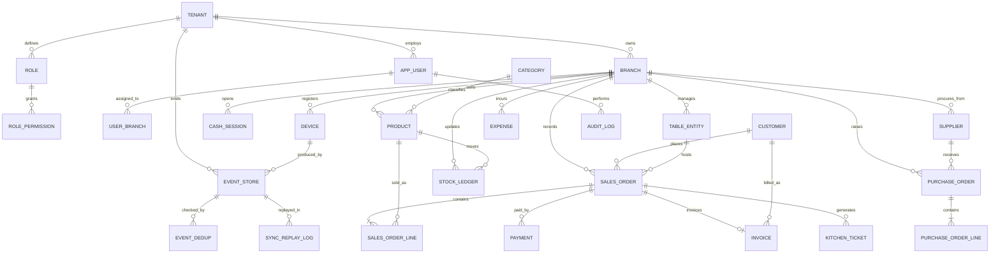
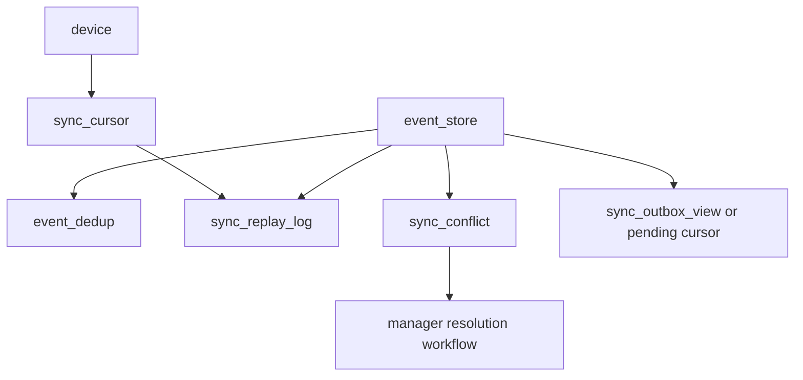
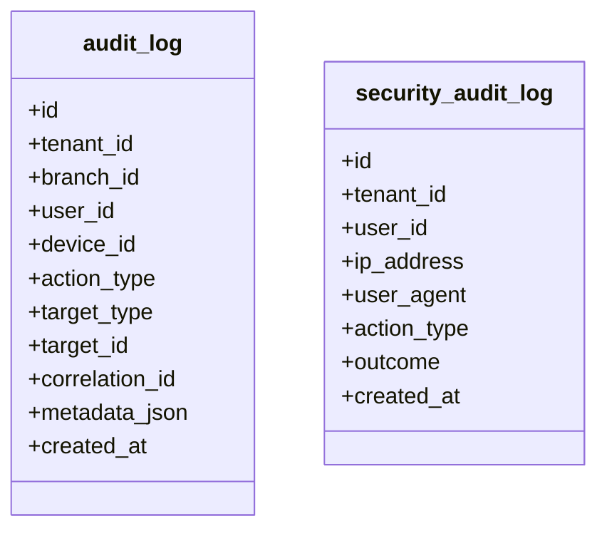
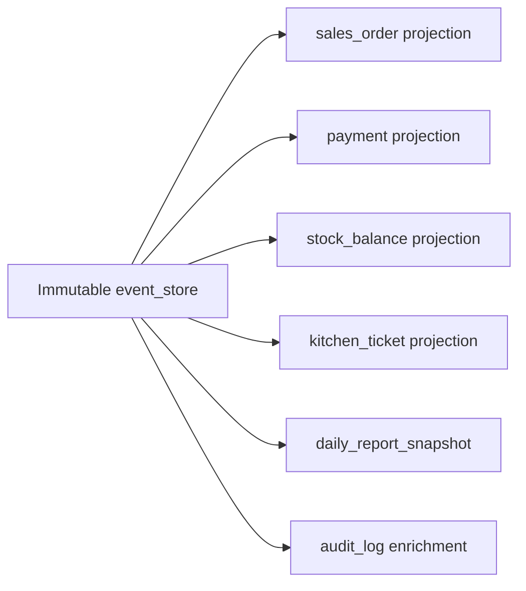

# 04. Database Design

## Database Principles

- PostgreSQL is the system of record for cloud-side authoritative data.
- Every business entity includes `tenant_id`; branch-scoped entities also include `branch_id`.
- Immutable events are stored separately from mutable projections.
- Audit tables are append-only.
- Synchronization metadata is explicit and queryable.
- Read models can be rebuilt from authoritative events where appropriate.

## Core ER Diagram

## Key Tables

| Table | Purpose |
|---|---|
| `tenant` | SaaS business root. |
| `branch` | Physical or logical operating location. |
| `app_user` | User identities linked to a tenant. |
| `role`, `permission`, `role_permission`, `user_branch` | Authorization model. |
| `device` | Registered POS, kitchen, or manager terminal. |
| `cash_session` | Cash drawer / shift session. |
| `sales_order`, `sales_order_line` | Order projections and line summaries. |
| `payment` | Payments and refunds. |
| `invoice` | Fiscal/commercial invoice record. |
| `table_entity`, `table_area` | Hospitality layout. |
| `product`, `category`, `modifier_group`, `price_book` | Catalog and pricing projections. |
| `stock_ledger`, `stock_balance`, `stock_count` | Inventory source and read models. |
| `supplier`, `purchase_order`, `purchase_order_line`, `goods_receipt` | Purchasing domain. |
| `customer` | CRM base entity. |
| `expense` | Branch expenses. |
| `event_store` | Immutable event envelopes. |
| `event_dedup` | Accepted UUID and sequence protection. |
| `sync_cursor`, `sync_replay_log`, `sync_conflict` | Synchronization tracking. |
| `audit_log`, `security_audit_log` | Business and security append-only logs. |

## Event and Sync Tables

### `event_store` Columns

| Column | Notes |
|---|---|
| `id` | Internal surrogate key. |
| `event_uuid` | Global immutable UUID; unique per tenant. |
| `tenant_id` | Mandatory tenant partition key. |
| `branch_id` | Branch scope. |
| `device_id` | Producing device. |
| `aggregate_type` | Order, payment, stock item, purchase order, etc. |
| `aggregate_id` | Business aggregate identifier. |
| `event_type` | `OrderCreated`, `PaymentReceived`, `InventoryAdjusted`, etc. |
| `device_sequence` | Monotonic per device, used for ordering and dedupe. |
| `aggregate_version` | Version expected after applying event. |
| `payload_json` | Immutable event payload. |
| `status` | `ACCEPTED`, `REPLAYED`, `CONFLICTED`, `REJECTED`. |
| `occurred_at` | Device timestamp. |
| `received_at` | Server ingestion time. |
| `schema_version` | Event schema evolution version. |
| `correlation_id` | Ties related events together. |
| `causation_id` | Parent event/command trace. |

## Audit Tables

## Offline-Related Tables

| Table | Purpose |
|---|---|
| `device` | Known devices, status, registration, last sync time. |
| `sync_cursor` | Last acknowledged server and device positions. |
| `event_dedup` | Prevent duplicate application of the same event UUID or already-accepted sequence range. |
| `sync_replay_log` | Per event replay outcome with timestamps and projection targets. |
| `sync_conflict` | Conflicts requiring deterministic rule application or manager review. |
| `projection_checkpoint` | Last projection build version for each read model. |

## Relationships and Constraints

| Constraint | Rule |
|---|---|
| Tenant isolation | Every business table includes `tenant_id` and queries must always filter by it. |
| Branch ownership | Branch-scoped tables must reference both `tenant_id` and `branch_id`. |
| Device uniqueness | `device(device_code, tenant_id, branch_id)` unique. |
| User uniqueness | `app_user(email, tenant_id)` unique if email-based login is tenant-scoped. |
| Order numbering | `sales_order(branch_id, business_date, local_order_number)` unique. |
| Event UUID uniqueness | `event_store(tenant_id, event_uuid)` unique. |
| Device sequence monotonicity | `event_store(tenant_id, device_id, device_sequence)` unique. |
| Invoice numbering | `invoice(tenant_id, branch_id, fiscal_year, invoice_number)` unique. |
| Product code | `product(tenant_id, branch_id, sku)` unique where SKU is enabled. |

## Indexes

| Table | Index |
|---|---|
| `sales_order` | `idx_sales_order_tenant_branch_status_created_at` on `(tenant_id, branch_id, status, created_at desc)` |
| `sales_order_line` | `idx_order_line_order_id` on `(sales_order_id)` |
| `payment` | `idx_payment_tenant_branch_paid_at` on `(tenant_id, branch_id, paid_at desc)` |
| `product` | `idx_product_tenant_branch_name` on `(tenant_id, branch_id, name)` |
| `customer` | `idx_customer_tenant_phone` on `(tenant_id, phone)` |
| `stock_ledger` | `idx_stock_ledger_tenant_branch_product_time` on `(tenant_id, branch_id, product_id, movement_time desc)` |
| `purchase_order` | `idx_po_tenant_branch_status_created_at` on `(tenant_id, branch_id, status, created_at desc)` |
| `event_store` | `idx_event_store_tenant_branch_received_at` on `(tenant_id, branch_id, received_at)` |
| `sync_conflict` | `idx_sync_conflict_tenant_branch_status` on `(tenant_id, branch_id, status)` |
| `audit_log` | `idx_audit_log_tenant_branch_created_at` on `(tenant_id, branch_id, created_at desc)` |

## Composite Indexes

| Table | Composite Index | Why |
|---|---|---|
| `event_store` | `(tenant_id, device_id, device_sequence)` | Fast dedupe and replay order per device. |
| `event_store` | `(tenant_id, aggregate_type, aggregate_id, aggregate_version)` | Aggregate history and version validation. |
| `sync_cursor` | `(tenant_id, branch_id, device_id)` | One sync position per device per branch. |
| `sales_order` | `(tenant_id, branch_id, business_date, local_order_number)` | Local numbering and order retrieval. |
| `stock_balance` | `(tenant_id, branch_id, product_id)` | Fast inventory reads in POS and counts. |
| `kitchen_ticket` | `(tenant_id, branch_id, station_code, status, priority)` | Kitchen display board filtering. |
| `role_permission` | `(role_id, permission_code)` | Permission matrix evaluation. |

## Projection Strategy

- `event_store` is authoritative for replayable history.
- Projections provide fast operational reads and can be rebuilt if corrupted.
- Some tables, such as `sales_order` and `stock_balance`, are maintained transactionally for current-state performance.

## Partitioning and Retention

- `event_store`, `audit_log`, and `security_audit_log` should be partitioned by month when scale justifies it.
- Cold retention can move older events to cheaper storage while keeping recent operational windows hot.
- Reports should aggregate from daily snapshots instead of scanning the full event stream for common queries.

