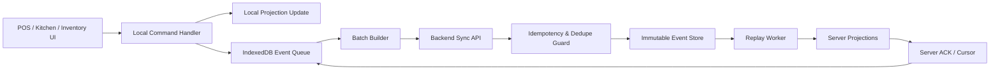
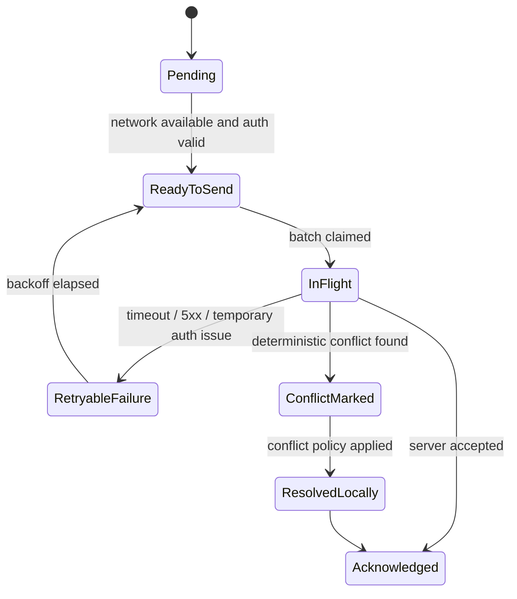
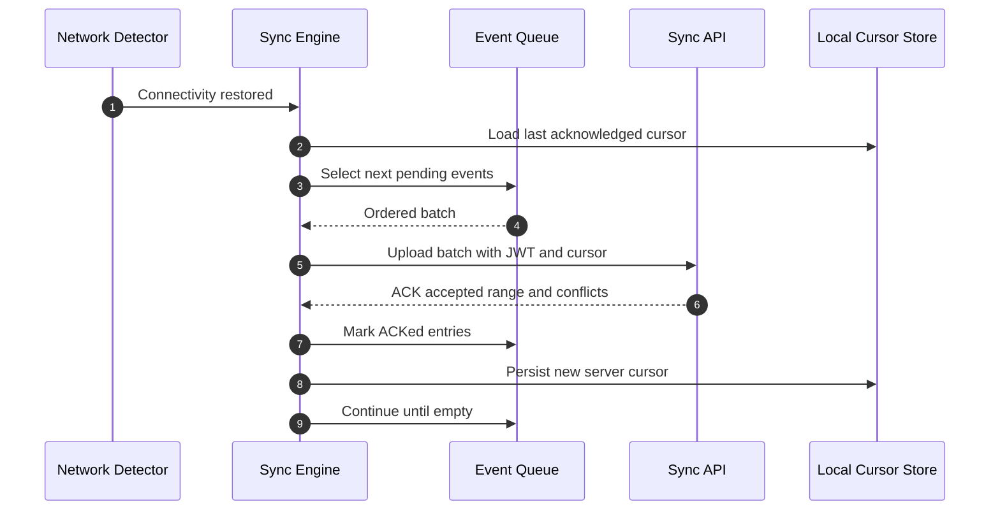
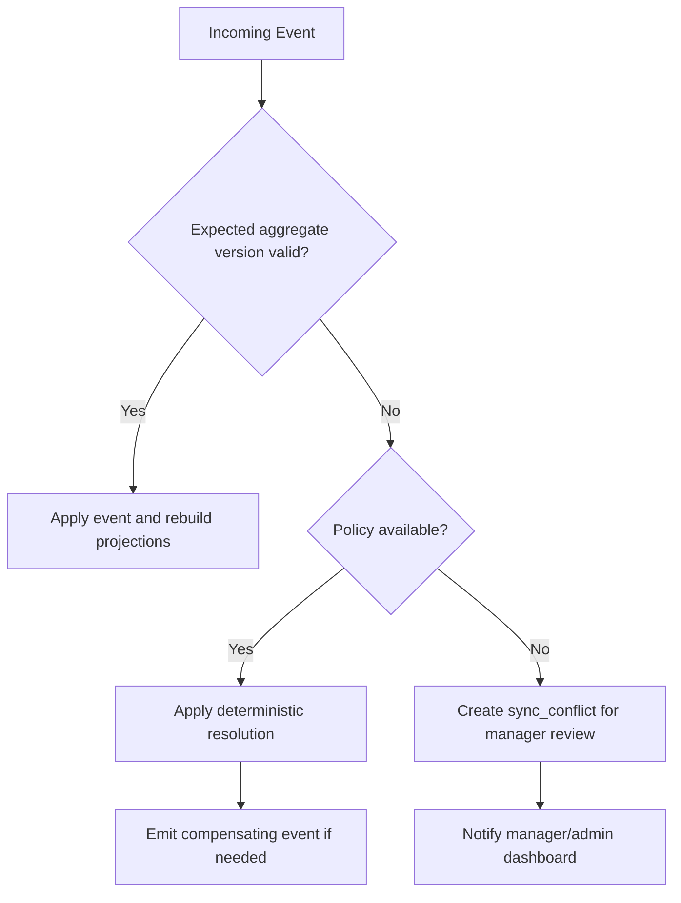
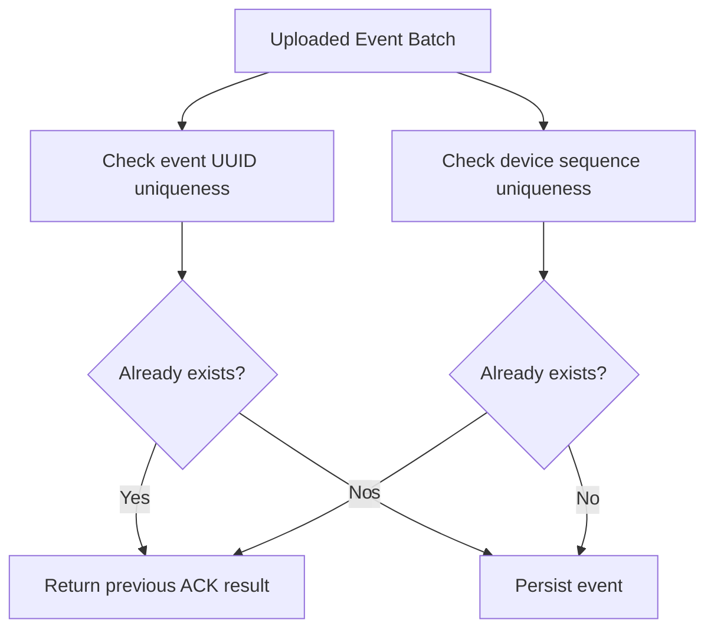
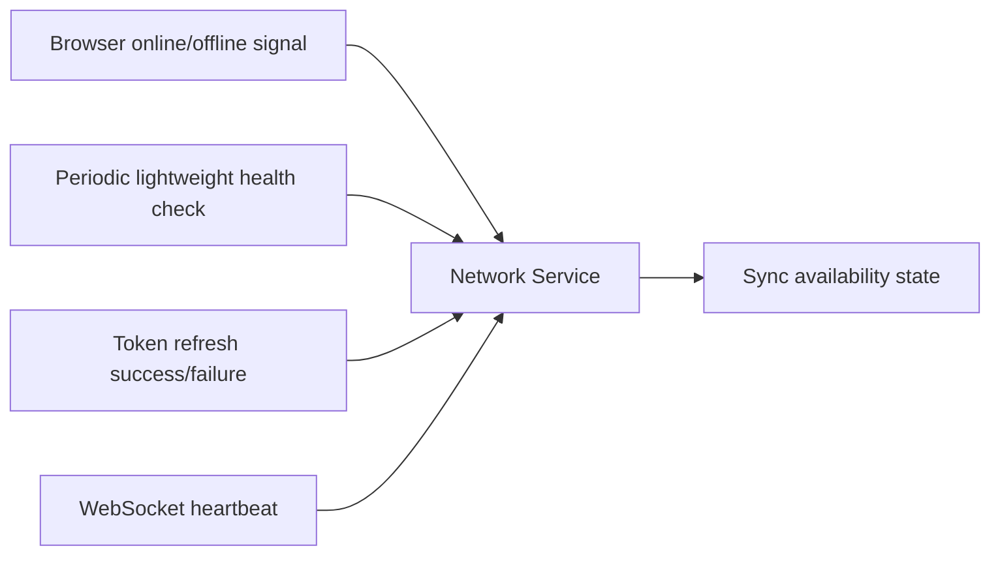
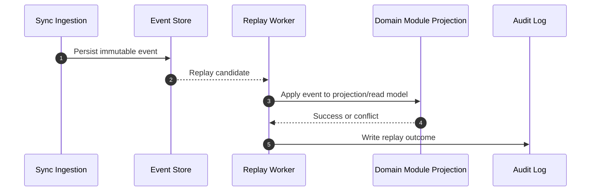
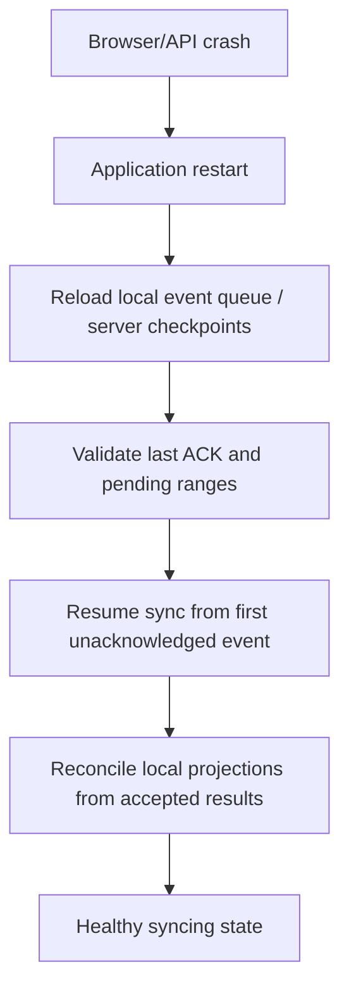

# 05. Sync Engine

## Sync Objectives

- Preserve uninterrupted branch operations during internet outages.
- Synchronize immutable events instead of mutable business objects.
- Guarantee deterministic replay on the backend.
- Prevent duplicates across retries, reconnects, and partial acknowledgements.
- Resolve conflicts without corrupting business history.
- Recover automatically after device restarts, browser restarts, or long outages.

## Event Contract

Each event carries:

- `eventUuid`
- `tenantId`
- `branchId`
- `deviceId`
- `deviceSequence`
- `timestamp`
- `eventType`
- `aggregateType`
- `aggregateId`
- `aggregateVersion`
- `schemaVersion`
- `status`
- `payload`
- `correlationId`
- `causationId`

## Sync Topology

## Offline Queue

### Queue Rules

- Events are appended locally in device sequence order.
- Queue entries are immutable except for sync metadata such as retry count and acknowledgement status.
- Local projections are updated immediately in the same Dexie transaction as event enqueueing.
- Event batches are uploaded in sequence order per device, but different devices may sync independently.
- The UI never waits for server acknowledgement to complete local business actions.

## Background Sync

### Background Sync Strategy

- Start automatically at login, app resume, browser reconnect, token refresh success, and periodic online heartbeat.
- Use short foreground loops when browser background sync APIs are unavailable.
- Limit batch size by event count and payload size.
- Preserve per-device ordering while allowing parallelism across independent devices.
- Stop only when queue is empty, token is invalid, or connectivity degrades again.

## Retry Strategy

| Failure Type | Client Action | Notes |
|---|---|---|
| Network timeout | Retry with exponential backoff and jitter | Do not change local user-facing state. |
| `5xx` server error | Retry with capped backoff | Alerts manager view if backlog grows. |
| `401` expired token | Refresh token, then retry | If refresh fails, keep local queue intact and request re-auth when feasible. |
| `409` conflict | Mark event/result with conflict metadata | Apply deterministic rule or manager review path. |
| Partial batch ACK | Mark accepted range, retry remaining tail | Requires batch item-level acknowledgement. |
| Device restart during sync | Reload queue and resume from cursor | Queue survives restart. |

### Backoff Policy

- Initial retry delay: 2 seconds.
- Exponential growth factor: 2x.
- Max delay: 5 minutes.
- Random jitter: 10 to 20 percent.
- Priority sync triggers: payment completion, order close, goods receiving, end-of-shift close.

## Conflict Resolution

Conflicts are resolved against event history, not by merging mutable objects.

### Conflict Policies

| Scenario | Rule |
|---|---|
| Same order updated by same device after retry | Idempotent accept based on event UUID or device sequence. |
| Same order updated by two devices in same branch | Server orders events by accepted sequence and aggregate version; invalid later event becomes conflict or compensation candidate. |
| Product price changed in cloud while offline sale occurred locally | Accept original offline sale at locally captured price, record price variance event for reporting. |
| Inventory count posted after sales occurred on another device | Count event becomes authoritative snapshot at its timestamp; subsequent movements replay after it. |
| Table moved while order was already closed elsewhere | Reject move event and log conflict because aggregate state no longer allows transition. |
| Customer updated from two devices | Last-write-wins for non-critical profile fields; append audit record for visibility. |
| Printer configuration changed during outage | Device continues using cached config until sync refresh brings newer settings. |

## Duplicate Prevention

Duplicate prevention relies on multiple guards:

1. `eventUuid` uniqueness per tenant.
2. `deviceId + deviceSequence` uniqueness per tenant.
3. Batch acknowledgement storing accepted sequence ranges.
4. Idempotent server command handler behavior keyed by event identity.
5. Client-side batch resend using the same event UUIDs, never regenerated UUIDs.

## Idempotency

- Every event replay operation must be safe to execute more than once.
- Projections use event identity tracking to ensure they are not updated twice.
- Financial side effects such as invoice numbering, cash movements, and refunds must use idempotency keys derived from event identity.
- Print audit records are idempotent at the server side, but branch-local printing may still occur once locally before sync; this is expected.

## Versioning

| Version Type | Purpose |
|---|---|
| `schemaVersion` | Event payload schema evolution. |
| `aggregateVersion` | Validates order of state transitions within an aggregate. |
| Projection version | Tracks whether read models are rebuilt against the latest event rules. |
| API version | Protects sync contract evolution between device app and server. |

### Versioning Rules

- Events are never mutated after creation.
- New schema versions must remain backward-readable by replay workers.
- Projection builders may branch by `schemaVersion` when rebuilding old history.
- Client app upgrades must preserve queue compatibility with already-stored offline events.

## Network Detection

### Detection Rules

- Browser online state alone is insufficient.
- A branch is considered effectively online only if HTTPS API health and authentication are both available.
- WebSocket health is informative but not required for sync.
- Flapping connectivity places the engine in degraded mode with smaller batches and conservative retry timing.

## Event Replay

### Replay Guarantees

- Replay order is guaranteed per aggregate and per device sequence.
- Global ordering across all tenants is unnecessary and avoided.
- Projection failures do not delete accepted events; they remain available for recovery replay.

## Recovery

### Recovery Scenarios

| Scenario | Recovery Behavior |
|---|---|
| Browser closes during outage | Queue and projections reload from IndexedDB on reopen. |
| Server accepts event but ACK response is lost | Resent event is treated idempotently and previous result is returned. |
| Projection bug discovered | Fix projection builder and replay authoritative events from event store. |
| Device clock drift | Server keeps both device timestamp and receive timestamp; reconciliation and reports prefer server-aware rules. |
| Long outage over many hours | Queue grows locally; UI remains responsive because reads use projections, not queue scans. |

## Failure Scenarios

| Scenario | Expected Outcome |
|---|---|
| Internet lost during payment | Payment is recorded locally, receipt prints locally, event queues for later sync. |
| Internet lost during kitchen update | Ticket state changes locally and syncs later; kitchen work continues. |
| Duplicate upload after timeout | Server returns prior acknowledgement without duplicating state change. |
| Inventory conflict from two devices | Conflict policy or manager review created without blocking new sales. |
| Refresh token expired while offline | Existing local session continues in degraded local mode until policy requires re-auth for protected admin operations. |
| Redis unavailable | Core transactional writes continue; realtime fanout degrades temporarily. |

## Operational Metrics

- Queue depth by device.
- Oldest unsynced event age.
- Replay latency by module.
- Conflict rate by event type.
- Duplicate detection rate.
- Projection rebuild duration.
- Branches currently degraded or offline.

