# 06. User Flows

## Login

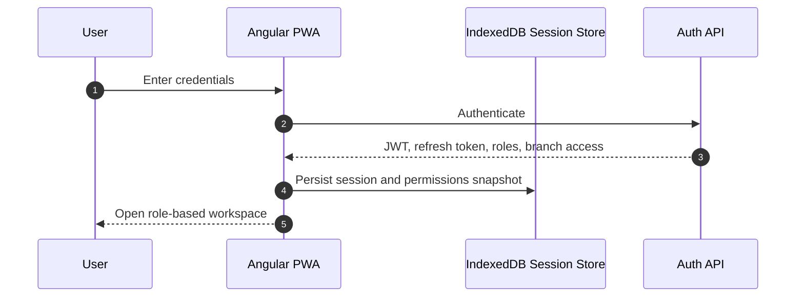

## Create Order

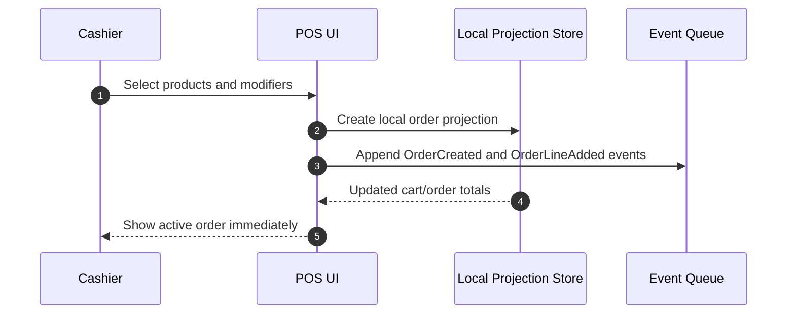

## Kitchen Flow

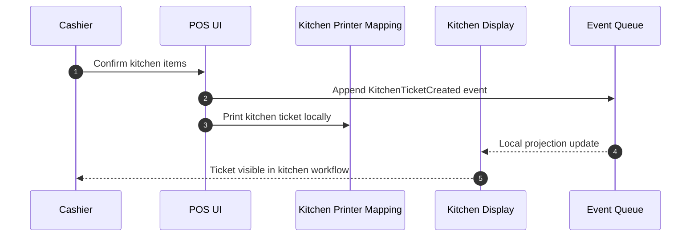

## Payment

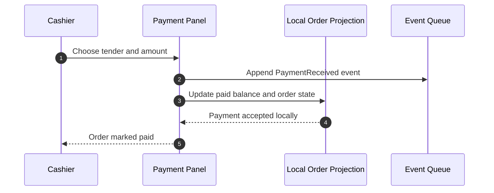

## Receipt

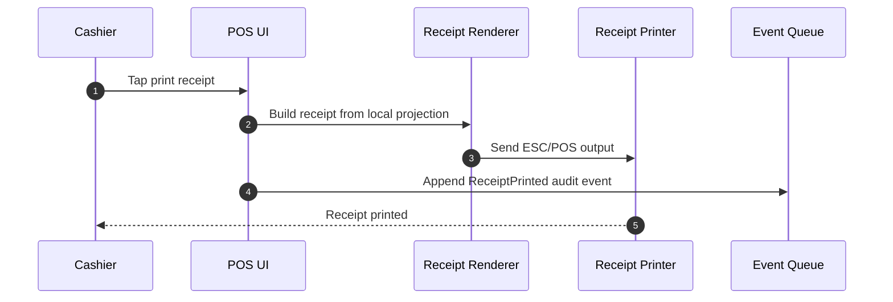

## Inventory Update

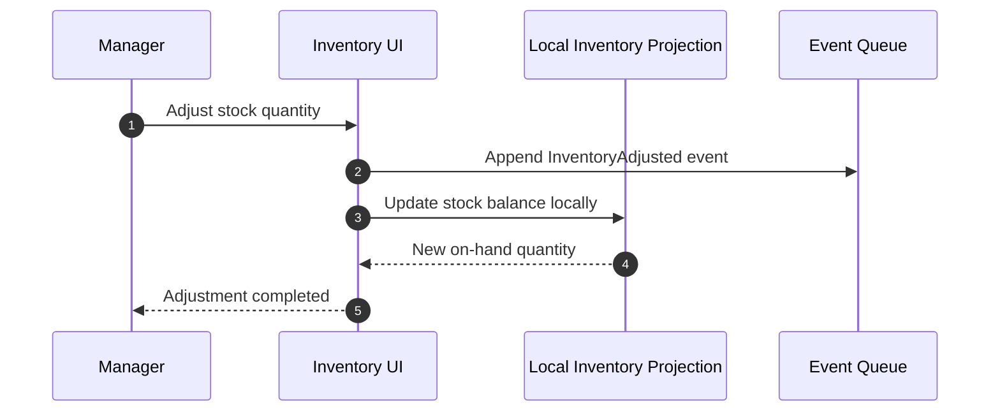

## Offline Sale

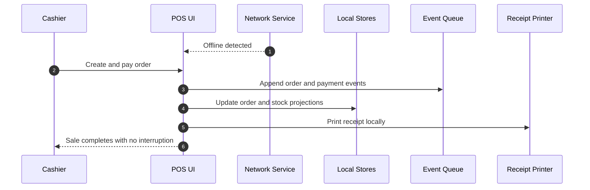

## Internet Recovery

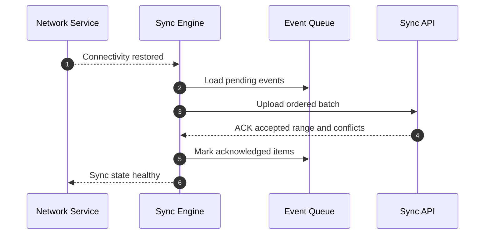

## Synchronization

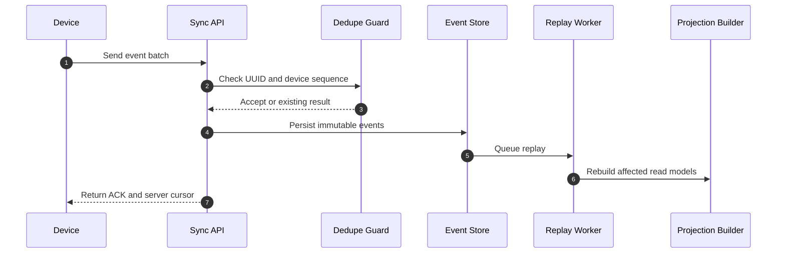

## Inventory Count

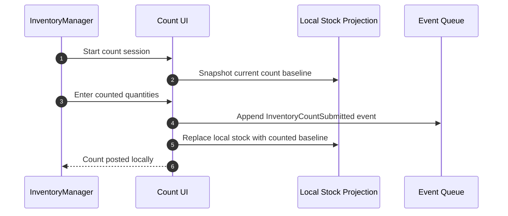

## Purchase Order

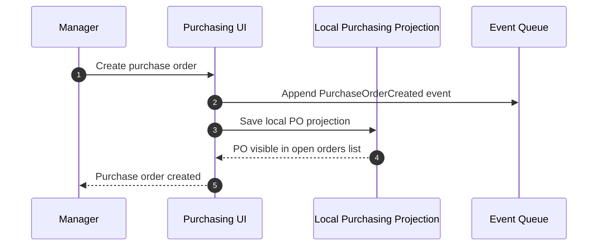

## Receiving Goods

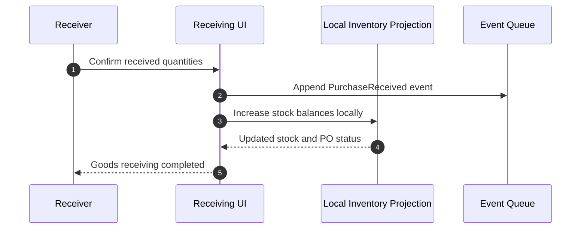

## Waste Recording

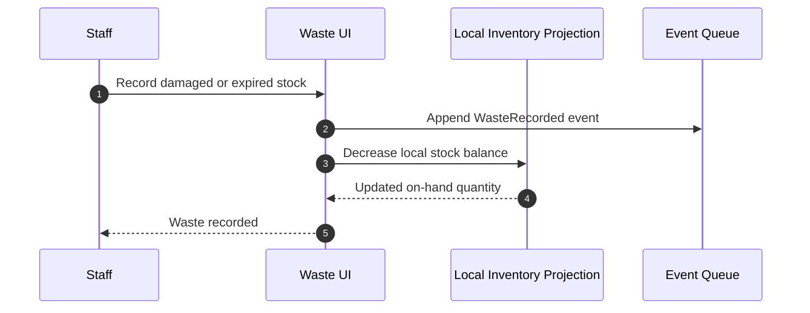

## Role Touchpoints Journey

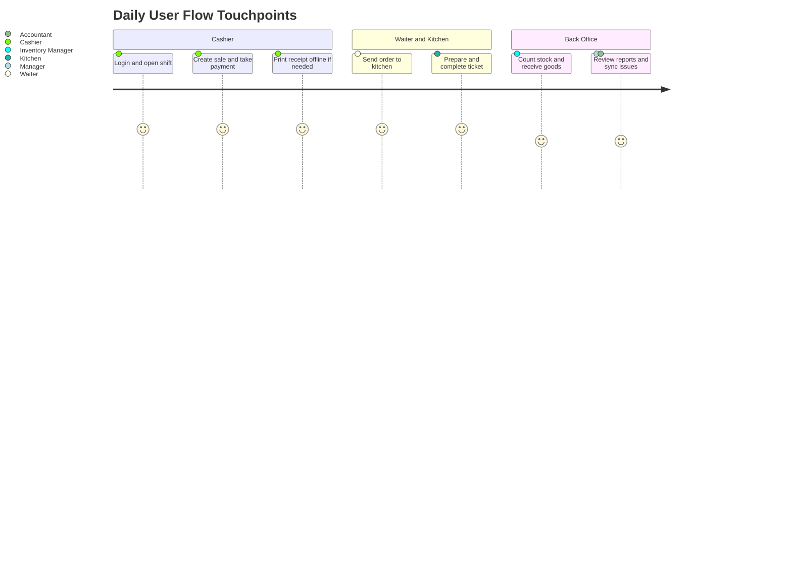

