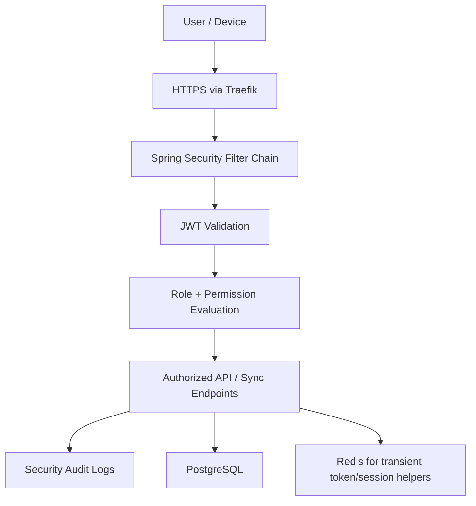
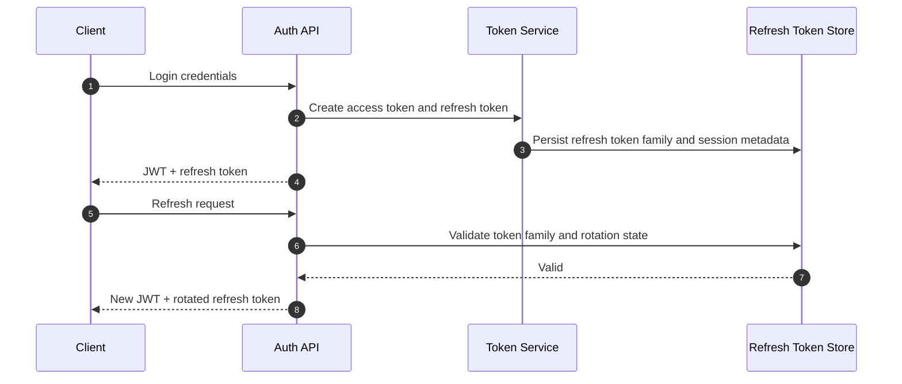
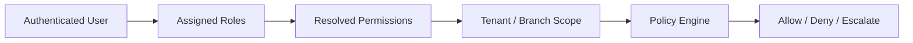
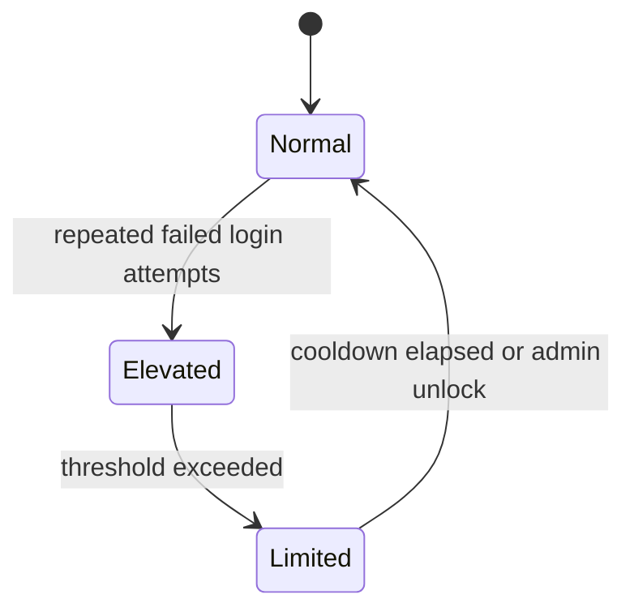
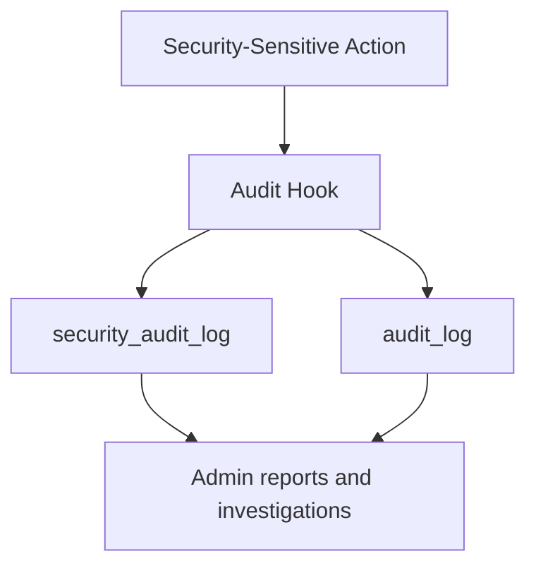

# 07. Security Architecture

## Security Goals

- Protect tenant data isolation across all layers.
- Secure authentication for online and degraded offline operation.
- Enforce role-based access at API, UI, and domain command levels.
- Make all security-sensitive actions auditable.
- Reduce attack surface for a publicly exposed SaaS platform on a single VPS.

## Security Architecture Overview

## JWT and Refresh Tokens

### Access Token

- Short-lived JWT used for API and sync requests.
- Contains `sub`, `tenantId`, branch claims where appropriate, role codes, permission snapshot version, device ID, and expiry.
- Signed with strong asymmetric or managed secret strategy; key rotation must be supported.

### Refresh Token

- Longer-lived opaque or signed token stored securely and rotated on each refresh.
- Bound to user, tenant, device, and session family.
- Revoked on logout, password reset, suspected compromise, or admin action.

## Authentication Rules

- Password login for initial authentication.
- Optional later addition of PIN fast unlock for local shift resume, but not as primary credential.
- Active device registration required for branch transaction privileges.
- Offline degraded mode uses last valid local permission snapshot for operational workflows until policy thresholds require re-authentication.

## Authorization Model

- Spring Security validates authentication.
- Authorization is permission-based, not only role-name based.
- Roles are templates; effective permissions are calculated per tenant and branch assignment.
- Domain commands perform final permission checks even if UI already hid actions.

## Permission Matrix

| Permission Domain | Super Admin | Business Owner | Manager | Cashier | Waiter | Kitchen | Inventory Manager | Accountant |
|---|---|---|---|---|---|---|---|---|
| Tenant administration | Full | Limited to owned tenant | No | No | No | No | No | No |
| Branch management | Full | Full | View/Edit assigned | No | No | No | No | No |
| User and role management | Full | Full | Limited assigned branch | No | No | No | No | No |
| POS order create/update | Full | Full | Full | Full | Full | No | No | View only |
| Order cancel / void | Full | Full | Full | Limited by policy | Limited by policy | No | No | View only |
| Payments / refunds | Full | Full | Full | Payments yes, refunds limited | No | No | No | Full view |
| Table operations | Full | Full | Full | Limited | Full | View only | No | No |
| Kitchen status updates | Full | Full | Full | View only | View only | Full | No | No |
| Inventory adjustments | Full | Full | Approve | No | No | No | Full | View only |
| Stock count | Full | Full | Approve | No | No | No | Full | View only |
| Purchasing / receiving | Full | Full | Approve | No | No | No | Full | View only |
| Expenses | Full | Full | Create/Approve branch | No | No | No | No | Full |
| Reports | Full | Full | Branch scope | Basic shift scope | No | No | Inventory scope | Finance scope |
| Sync conflict resolution | Full | Full | Full | No | No | No | Limited inventory conflicts | View only |
| Printer configuration | Full | Full | Branch scope | No | No | No | No | No |

## Role Evaluation Flow

## Password Storage

- Passwords stored only as adaptive one-way hashes such as Argon2id or BCrypt with strong work factor.
- Per-user salts are mandatory.
- Password reset tokens are single use, short lived, and hashed at rest.
- Plaintext passwords are never logged, cached, or stored in local browser databases.

## CSRF

- If JWTs are used in `Authorization` headers rather than cookie-based session auth, CSRF risk is substantially reduced for APIs.
- Refresh endpoints using cookies would require CSRF protection tokens and same-site settings.
- Admin web forms and any cookie-bound flows must include CSRF defenses explicitly.

## XSS

- Angular template escaping provides the first protection layer.
- Avoid direct HTML injection; sanitize any rich text input rendered back to the UI.
- Use strict Content Security Policy headers where possible.
- Store printer templates and receipt layouts in safe structured formats rather than raw executable markup.

## SQL Injection

- Use JPA/Hibernate parameter binding only.
- No string-concatenated SQL in application code.
- Native SQL, where needed for reporting, must use positional or named parameters and be reviewed carefully.
- Database roles should enforce least privilege for application connections.

## Rate Limiting

### Rate-Limited Surfaces

- Login endpoint.
- Refresh token endpoint.
- Password reset endpoint.
- Public webhook endpoints if introduced later.
- Sensitive admin operations such as user invitation or branch creation.

Redis is the preferred backing store for short-window counters because it is efficient and disposable.

## Audit Logs

### Mandatory Audit Events

- Login success and failure.
- Logout and forced logout.
- Password change and reset.
- Role or permission assignment.
- Branch/device registration changes.
- Order voids, refunds, discount overrides, inventory adjustments, and expense approvals.
- Conflict resolution and replay failure repair actions.

## Device and Local Security

- Register each device with tenant and branch ownership.
- Persist minimal auth context locally; never store plaintext credentials.
- Encrypt or obfuscate sensitive local storage where practical, acknowledging browser limitations.
- Require privileged re-authentication for critical admin actions after prolonged offline periods.

## Security Hardening Checklist

| Control | Decision |
|---|---|
| HTTPS | Mandatory through Traefik and Let's Encrypt or managed certificates. |
| Secret management | Inject via Dokploy secrets, never hardcode in images. |
| Database exposure | PostgreSQL and Redis internal network only. |
| CORS | Restrict to known frontend origins. |
| Headers | HSTS, X-Content-Type-Options, Referrer-Policy, CSP where feasible. |
| Logging | Structured, redacted, correlation-aware. |
| Backups | Encrypted at rest and tested with restore drills. |

