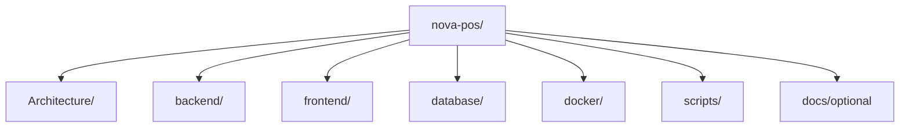
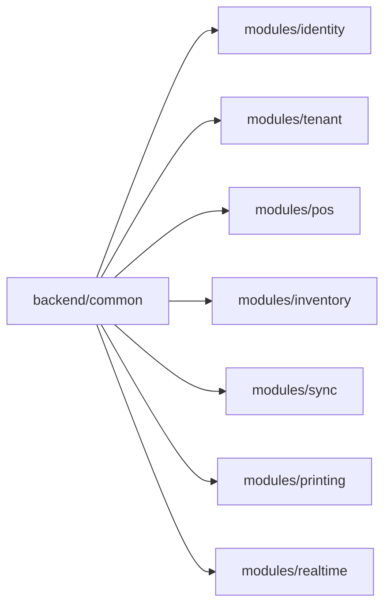
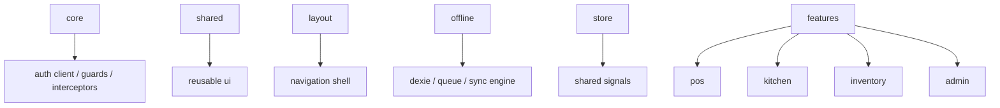
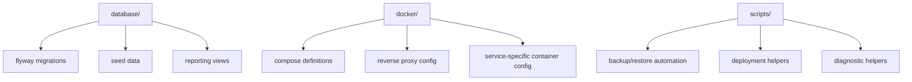

# 08. Folder Structure

## Repository Layout Principles

- Separate architecture, backend, frontend, database, infrastructure, and scripts clearly.
- Keep module ownership visible from folder names.
- Mirror backend modular-monolith boundaries in package layout.
- Isolate offline and synchronization concerns in dedicated frontend and backend areas.

## Repository Structure Diagram



## Complete Folder Tree

```text
nova-pos/
├── Architecture/
│   ├── 01-system-overview.md
│   ├── 02-backend-architecture.md
│   ├── 03-frontend-architecture.md
│   ├── 04-database.md
│   ├── 05-sync-engine.md
│   ├── 06-user-flows.md
│   ├── 07-security.md
│   ├── 08-folder-structure.md
│   ├── 09-deployment.md
│   └── 10-roadmap.md
├── backend/
│   ├── pom.xml
│   └── src/
│       ├── main/
│       │   ├── java/com/novapos/
│       │   │   ├── bootstrap/
│       │   │   ├── common/
│       │   │   │   ├── config/
│       │   │   │   ├── error/
│       │   │   │   ├── security/
│       │   │   │   ├── tenancy/
│       │   │   │   ├── events/
│       │   │   │   ├── audit/
│       │   │   │   └── util/
│       │   │   ├── modules/
│       │   │   │   ├── identity/
│       │   │   │   ├── authorization/
│       │   │   │   ├── tenant/
│       │   │   │   ├── pos/
│       │   │   │   ├── tables/
│       │   │   │   ├── kitchen/
│       │   │   │   ├── catalog/
│       │   │   │   ├── inventory/
│       │   │   │   ├── purchasing/
│       │   │   │   ├── customers/
│       │   │   │   ├── payments/
│       │   │   │   ├── invoicing/
│       │   │   │   ├── expenses/
│       │   │   │   ├── reports/
│       │   │   │   ├── notifications/
│       │   │   │   ├── sync/
│       │   │   │   ├── printing/
│       │   │   │   └── realtime/
│       │   │   └── jobs/
│       │   └── resources/
│       │       ├── application.yml
│       │       ├── db/migration/
│       │       ├── templates/
│       │       └── messages/
│       └── test/
│           ├── java/
│           └── resources/
├── frontend/
│   ├── package.json
│   └── src/
│       ├── app/
│       │   ├── core/
│       │   ├── shared/
│       │   ├── layout/
│       │   ├── offline/
│       │   ├── store/
│       │   ├── features/
│       │   │   ├── auth/
│       │   │   ├── dashboard/
│       │   │   ├── pos/
│       │   │   ├── kitchen/
│       │   │   ├── inventory/
│       │   │   ├── purchasing/
│       │   │   ├── customers/
│       │   │   ├── reports/
│       │   │   ├── settings/
│       │   │   └── admin/
│       │   └── app.routes.ts
│       ├── assets/
│       ├── environments/
│       └── styles/
├── database/
│   ├── flyway/
│   │   ├── baseline/
│   │   ├── repeatable/
│   │   └── versioned/
│   ├── seed/
│   ├── views/
│   ├── functions/
│   └── backup/
├── docker/
│   ├── docker-compose.yml
│   ├── docker-compose.prod.yml
│   ├── traefik/
│   ├── postgres/
│   ├── redis/
│   ├── backend/
│   └── frontend/
├── scripts/
│   ├── build/
│   ├── deploy/
│   ├── backup/
│   ├── restore/
│   ├── local/
│   └── diagnostics/
└── .github/
    └── workflows/
```

## Backend Package Ownership



### Backend Folder Responsibilities

| Folder | Responsibility |
|---|---|
| `bootstrap` | Spring Boot startup and application composition. |
| `common/config` | Shared runtime configuration. |
| `common/security` | Security filters, token support, and policy primitives. |
| `common/events` | Shared event envelope and event handling contracts. |
| `modules/*` | Domain modules with internal application, domain, and infrastructure layers. |
| `jobs` | Background workers, schedulers, cleanup, replay, and reporting jobs. |
| `resources/db/migration` | Flyway migrations. |

## Frontend Ownership Map



## Database and Infrastructure Folders



