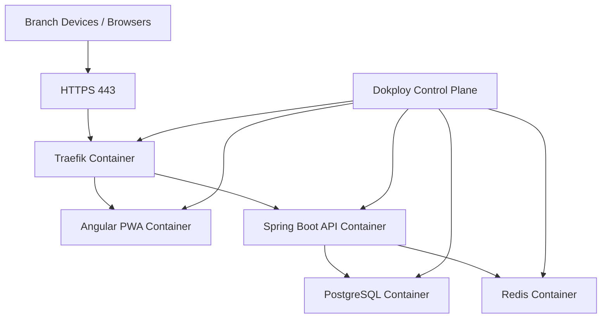
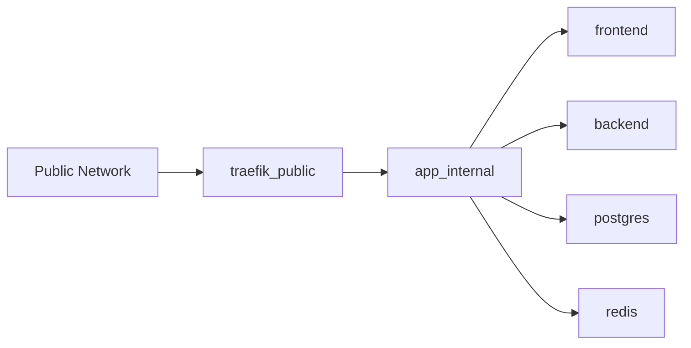
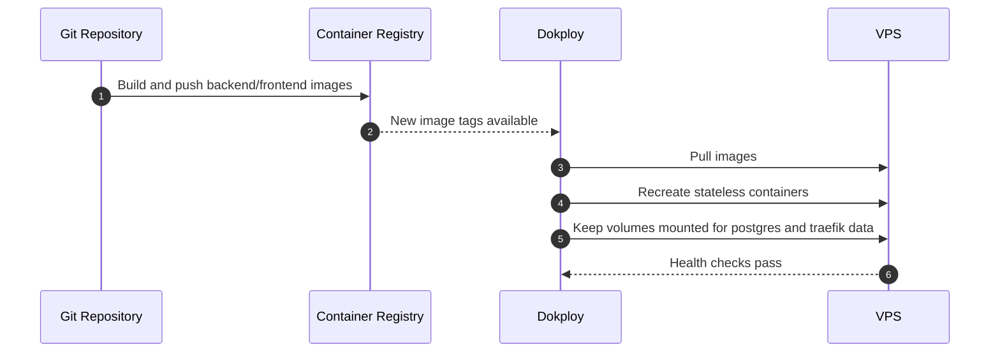
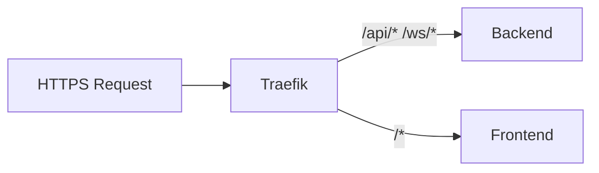
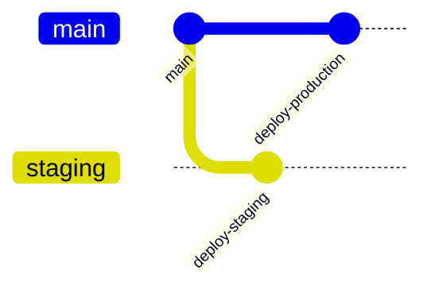
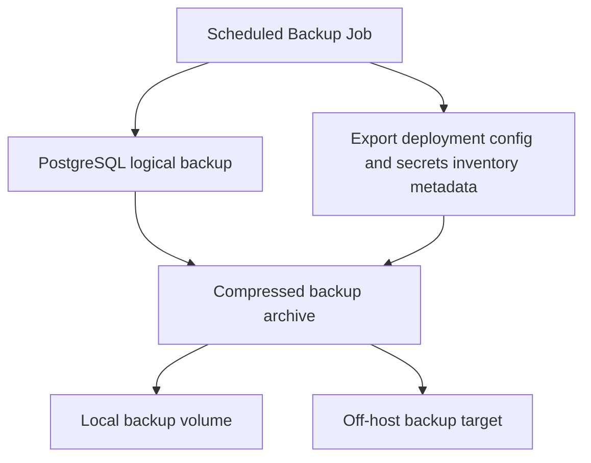
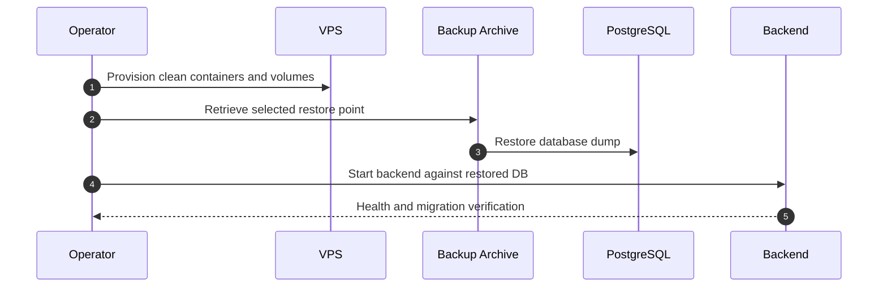

# 09. Deployment Architecture

## Deployment Objectives

- Run the full SaaS platform on a single VPS using Dokploy and Docker.
- Expose only HTTPS traffic through Traefik.
- Keep PostgreSQL and Redis private on the internal Docker network.
- Persist data safely with volumes and verified backups.
- Maintain an upgrade path from single-node simplicity to future scale-out if needed.

## Target Runtime Topology

## Docker Containers

| Container | Purpose | Persistence |
|---|---|---|
| `traefik` | TLS termination, host routing, compression, headers | Config volume and certificate storage volume |
| `frontend` | Serves Angular build artifacts | Stateless |
| `backend` | Runs Spring Boot modular monolith | Stateless except logs if mounted |
| `postgres` | Primary relational data store | Persistent data volume |
| `redis` | Cache, rate limiting helpers, transient realtime coordination | Optional append-only volume depending on policy |

## Networking

### Network Rules

- Only Traefik binds public ports.
- Backend, PostgreSQL, and Redis are reachable only on the internal Docker network.
- Frontend may be served behind Traefik as static assets or via a small web server container.
- Database access from outside Docker is blocked except for tightly controlled admin operations.

## Dokploy Deployment Flow

## Traefik Responsibilities

- Route frontend and backend traffic by host and path.
- Enforce HTTPS redirect.
- Manage TLS certificates.
- Apply security headers and compression.
- Support websocket upgrade for realtime endpoints.

## HTTPS

- HTTPS is mandatory in all environments exposed to users.
- Use Let's Encrypt or equivalent certificate automation through Traefik.
- Enable HSTS after domain and certificate stability is confirmed.
- WebSocket endpoints must be served through the same TLS termination layer.

## Volumes

| Volume | Used By | Contents |
|---|---|---|
| `postgres_data` | PostgreSQL | Database files and WAL-related data. |
| `traefik_certs` | Traefik | ACME certificate storage. |
| `backend_logs` | Backend optional | Structured application logs if log shipping is not yet externalized. |
| `redis_data` | Redis optional | Append-only or snapshot data if persistence is enabled. |
| `backup_archive` | Backup job container or host mount | Logical backups and compressed export bundles. |

## Secrets

- Store secrets in Dokploy-managed secret injection, not inside images or git.
- Required secrets include:
  - database password
  - JWT signing keys or key references
  - refresh token secret if symmetric
  - initial admin bootstrap secret
  - SMTP or notification provider secrets if enabled later
  - backup storage credentials if off-host storage is used

## Environment Variables

| Variable | Purpose |
|---|---|
| `APP_ENV` | Deployment environment name. |
| `SERVER_PORT` | Internal backend port. |
| `SPRING_DATASOURCE_URL` | PostgreSQL connection string. |
| `SPRING_DATASOURCE_USERNAME` | PostgreSQL user. |
| `SPRING_DATASOURCE_PASSWORD` | PostgreSQL password. |
| `SPRING_REDIS_HOST` / `SPRING_REDIS_PORT` | Redis connection settings. |
| `JWT_PRIVATE_KEY` / `JWT_PUBLIC_KEY` or `JWT_SECRET` | Token signing material. |
| `CORS_ALLOWED_ORIGINS` | Allowed frontend origins. |
| `TRAEFIK_HOST_FRONTEND` | Public host for app UI. |
| `TRAEFIK_HOST_API` | Public API host if separate. |
| `BACKUP_RETENTION_DAYS` | Backup retention policy. |

## Deployment Environments

- `staging`: mirrors production topology on lower scale and is used for migration and sync validation.
- `production`: single VPS live environment with monitored backups and HTTPS.

## Backup Strategy

### Backup Rules

- Run PostgreSQL logical backups at least daily.
- Keep transaction-log-aware strategy if near-zero-loss recovery becomes required later.
- Export important Traefik and deployment configuration metadata.
- Store backups off-host to survive VPS failure.
- Regularly test restore, not just backup creation.

## Restore Strategy

### Restore Priorities

1. Restore database first.
2. Restore application configuration and secrets.
3. Start backend and verify Flyway state.
4. Start frontend and validate routing.
5. Verify login, sync endpoints, and websocket connectivity.

## Operational Monitoring

- Container health status.
- PostgreSQL disk growth, connection count, and backup success.
- Redis memory usage and evictions.
- Backend error rate, sync backlog, and websocket connection count.
- Traefik TLS renewal and routing health.

## Single-VPS Constraints and Mitigations

| Constraint | Mitigation |
|---|---|
| Single node failure | Off-host backups, documented restore runbook, optional warm standby later. |
| Shared CPU/RAM | Limit container resources and profile sync/report jobs. |
| Disk contention | Separate backup retention and monitor PostgreSQL growth. |
| No service isolation | Strong module boundaries inside backend and internal Docker networking. |

