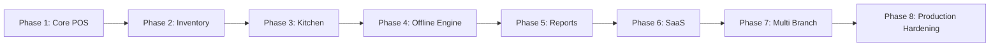
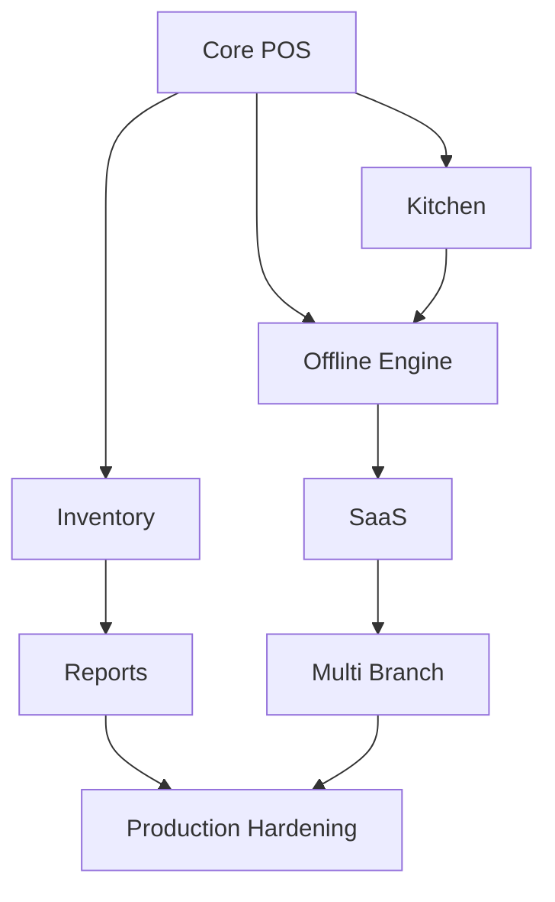
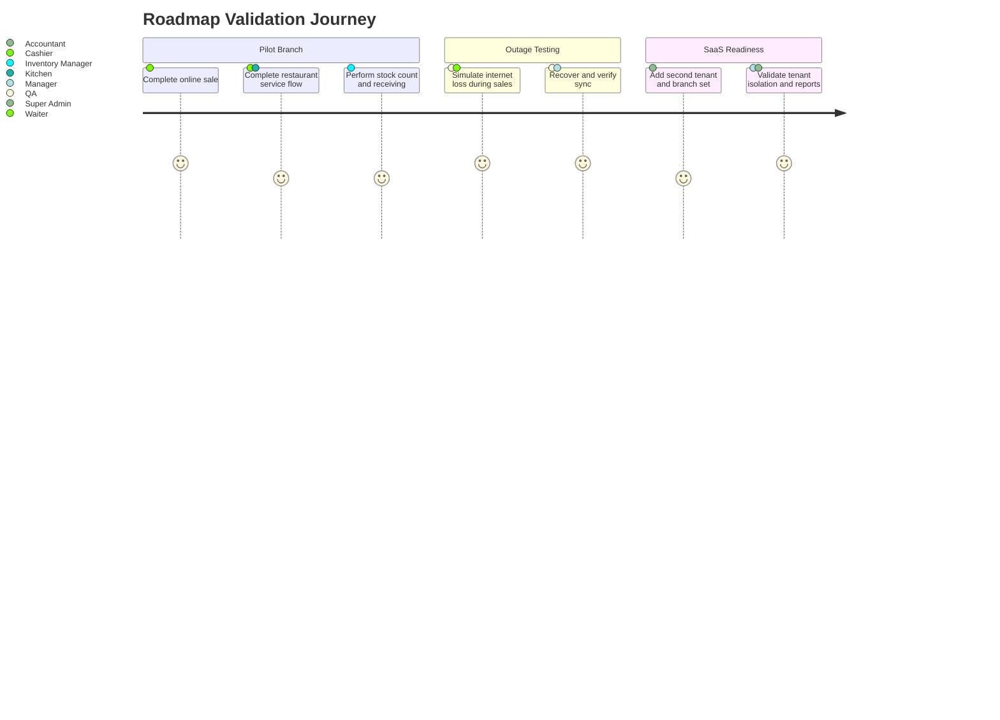
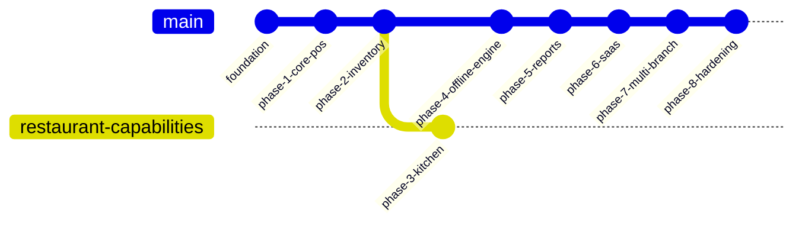

# 10. Implementation Roadmap

## Roadmap Principles

- Build the smallest valuable operational core first.
- Introduce offline-first foundations early enough that later modules do not require redesign.
- Validate each phase with real branch workflows, not only technical completion.
- Keep modular-monolith boundaries stable from phase 1 onward.

## Phase Overview

## Phase 1: Core POS

### Scope

- Authentication and authorization foundations.
- Business, branch, device, user, and role baseline.
- Product catalog, categories, taxes, pricing basics.
- Order lifecycle, payments, refunds baseline, receipts, cash sessions.
- Basic printer routing for receipt and kitchen-ready expansion.

### Deliverables

- Branch login and device activation.
- Cashier POS screen.
- Order create/update/cancel flow.
- Payment and receipt flow.
- Baseline audit log.

### Exit Criteria

- A cashier can complete a full sale online in a branch.
- Receipts print successfully.
- Permission checks prevent unauthorized actions.

## Phase 2: Inventory

### Scope

- Stock ledger and on-hand projections.
- Inventory adjustments, counts, waste, low-stock visibility.
- Supplier management and product-cost linkage.

### Exit Criteria

- Sales consume stock consistently.
- Managers can perform counts and adjustments.
- Inventory movements are fully auditable.

## Phase 3: Kitchen

### Scope

- Table areas and table assignment.
- Kitchen ticket generation.
- Kitchen display or preparation board.
- Preparation status lifecycle.

### Exit Criteria

- Restaurant workflow supports waiter-to-kitchen-to-payment lifecycle.
- Kitchen tickets can print and display correctly.

## Phase 4: Offline Engine

### Scope

- IndexedDB/Dexie local storage.
- Local projections for POS, kitchen, and inventory.
- Immutable event queue, sync API, replay logic, dedupe, retry.
- Automatic internet recovery sync.

### Exit Criteria

- Branch can complete sales during a multi-hour outage.
- Recovery sync runs automatically without user action.
- Duplicate uploads and lost ACK scenarios behave idempotently.

## Phase 5: Reports

### Scope

- Daily sales dashboards.
- Cash reconciliation.
- Inventory movement summaries.
- Purchase and expense summaries.

### Exit Criteria

- Managers and accountants can consume branch-level operational reporting.
- Reports reconcile with event history and current projections.

## Phase 6: SaaS

### Scope

- Tenant isolation hardening.
- Subscription-ready tenant management.
- Super admin console.
- Tenant provisioning and lifecycle workflows.

### Exit Criteria

- Multiple businesses can run safely on the same platform.
- Tenant boundaries are enforced end to end.

## Phase 7: Multi Branch

### Scope

- Business-level branch management.
- Cross-branch reporting and permissions.
- Branch-specific catalogs, printers, and operating settings where needed.

### Exit Criteria

- One business can operate multiple branches with isolated operations and consolidated oversight.

## Phase 8: Production Hardening

### Scope

- Security hardening, backups, restore drills, monitoring, alerting.
- Performance tuning, partitioning, retention, and operational runbooks.
- Load validation and failure scenario rehearsals.

### Exit Criteria

- Platform is ready for controlled production rollout with operational confidence.

## Milestone Dependencies

## Recommended Delivery Tracks

| Track | Focus |
|---|---|
| Track A | Backend domain modules, security, persistence, sync APIs |
| Track B | Frontend POS, kitchen, inventory, admin shell |
| Track C | Infrastructure, CI/CD, monitoring, backups, deployment |
| Track D | QA automation, outage simulation, replay verification, regression packs |

## Validation Journey

## Recommended Milestone Order by Risk

## Release Governance

- No phase exits without role-based acceptance criteria.
- No offline engine release without long-outage and duplicate replay testing.
- No SaaS release without tenant isolation penetration and authorization review.
- No production rollout without verified restore rehearsal.

